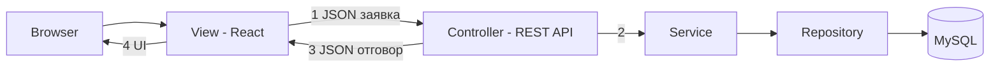

# Glava 3 - vazstanoveno ot chat 9c45e542

Za Word kopirai razdel PREPORUCHITELNA + instrukciite za figurite.

---

## Plan i struktura

Да — **същата логика на съдържанието** е стандартна за дипломна по софтуер и подхожда на вашия проект. По-долу е **вашата глава 3** по същия шаблон, съобразена с carpool приложението (Spring Boot + React/TypeScript).

---

## Съдържание (както при примера)

**ГЛАВА III. ПРОЕКТИРАНЕ НА СОФТУЕРНИЯ ПРОДУКТ И МОДЕЛ НА ДАННИТЕ**

- **3.1 Избор на средства за реализация**
- **3.2 Архитектура**
- **3.3 Визуализация**
- **3.4 Модел на данните**
  - **3.4.1 Описание на използваните таблици**

*(номерата на страниците в Word ще се попълнят автоматично след като вкарате текста.)*

---

## Какво пишеш във всеки раздел (кратък план)

### 3.1 Избор на средства за реализация
**Цел:** Защо сте избрали тези технологии, не как да ги инсталирате.

| Тема | Какво да включиш |
|------|------------------|
| Backend | Java, Spring Boot (REST API, Security, JPA) |
| Frontend | React, TypeScript, маршрутизация, UI библиотека (ако ползвате) |
| База данни | PostgreSQL (или каквото реално ползвате) |
| Карта | Leaflet / OpenStreetMap (или Google Maps — както е в кода) |
| Плащания | Stripe Checkout + webhook |
| Сървър/среда | Maven/Gradle, Node/npm за frontend, Docker (ако има) |

**1–2 изречения на технология:** какво решава в *вашата* система (напр. Spring Security → автентикация; JPA → обектно-релационен модел).

**Фигура (по избор):** таблица „Средство | Версия | Роля в системата“.

---

### 3.2 Архитектура
**Цел:** Как са свързани частите — след глава 2 (какво прави), преди глава 4 (как е кодирано).

Типично описание за вашия тип проект:

1. **Клиент–сървър:** браузър (SPA) ↔ REST API ↔ база данни  
2. **Слоеве на backend:** Controller → Service → Repository → Entity  
3. **Frontend:** страници/компоненти → API клиент → backend  
4. **Външни услуги:** Stripe, (карта), имейл/нотификации (ако има)

**Фиг. 3.1** — диаграма на архитектурата (блокове: React, Spring Boot, PostgreSQL, Stripe).  
*Без източник под фигурата* — собствена схема.

Можеш кратко да споменеш **JWT/сесия**, **CORS**, **webhook за плащане** — само на ниво проектиране, без код.

---

### 3.3 Визуализация
При другата дипломна тук е **UI/UX и екрани**, не „визуализация на данни“.

Включи:

- Обща идея за интерфейса (език, навигация, роли)
- Основни екрани: начало, търсене на пътуване, детайли, създаване на пътуване, резервации, профил, чат, карта, админ
- **Фиг. 3.2, 3.3…** — снимки от работещото приложение (или wireframe), с надписи „Фиг. 3.2. Екран за търсене на пътувания“ и т.н.

Свържи с **глава 2:** всеки екран покрива изисквание от 2.3 (регистрация, резервация, плащане…).

---

### 3.4 Модел на данните

**3.4 (общо):**

- Защо е релационен модел  
- Основни **същности** и връзки: потребител, пътуване, резервация, плащане, съобщение, оценка, (роли/админ)  
- **Фиг. 3.X** — ER диаграма (собствена)

**3.4.1 Описание на използваните таблици**

Таблица или подраздели за всяка таблица, например:

| Поле | Тип | Описание |
|------|-----|----------|
| id | PK | … |
| … | … | … |

**Връзки:** 1:N потребител → пътувания; пътуване → много резервации; резервация → плащане; и т.н.

Имената на таблиците вземи **точно от кода** (`@Entity` / `@Table`) — при преглед на проекта попълваш реалните колони.

---

## Как се връзва с останалите глави


- **Глава 2** — *какво* трябва да може системата  
- **Глава 3** — *с какво* и *как е проектирана* (технологии, архитектура, екрани, БД)  
- **Глава 4** (обикновено следва) — *реализация*: класове, API, фрагменти код, тестове  

Не дублирай в 3.4 целия код от глава 4 — в 3.4 са **модел и таблици**, в 4 — **имплементация**.

---

## Примерно въведение за глава III (за копиране в Word)

> В настоящата глава се представя проектирането на разработения софтуерен продукт за организиране на споделени пътувания. Първо се обосновава изборът на средства за реализация. След това се описва архитектурата на системата и визуализацията на потребителския интерфейс. Накрая се представя моделът на данните и структурата на основните таблици в базата данни, които поддържат функционалностите, дефинирани в глава II.

---

## Какво да подготвиш като материали

| Материал | Раздел |
|----------|--------|
| Таблица технологии | 3.1 |
| Архитектурна схема | 3.2, Фиг. 3.1 |
| 4–8 screenshot-а от приложението | 3.3 |
| ER диаграма | 3.4 |
| Описание на таблиците | 3.4.1 |

---

Ако искаш, в следващо съобщение мога да ти напиша **готов текст за 3.1 и 3.2** (2–3 страници на български) — за това трябва да отворя проекта ви и да извлека точните технологии, пакети и имена на таблиците от кода. Кажи дали базата ви е PostgreSQL и дали имате Docker — ще ги впиша точно в текста.

---

## Palen tekst v1 PostgreSQL - ostaryala

По-долу е **пълен текст за глава III** на български — подробен, в стил на примера от другата дипломна. Структурата е: **3.1 → 3.2 → 3.3 → 3.4 → 3.4.1**. След като вкараш текста в Word, сложи **Фиг.** там, където е отбелязано, и провери **имената на колоните** спрямо `*Entity.java` в проекта (ако някое поле се казва различно в кода, смени само таблицата в 3.4.1).

---

# ГЛАВА III. ПРОЕКТИРАНЕ НА СОФТУЕРНИЯ ПРОДУКТ И МОДЕЛ НА ДАННИТЕ

В настоящата глава се представя проектирането на разработеното уеб приложение за организиране на споделени пътувания. Проектирането обхваща избора на технологии и инструменти, с които ще бъде реализирана системата, описание на архитектурата и взаимодействието между нейните компоненти, визуализация на потребителския интерфейс и модел на данните, който поддържа функционалностите, формулирани в глава II.

Проектирането следва логиката „от изискванията към структурата“: първо се определят средствата за реализация, след това се дефинира как са разпределени отговорностите между клиент, сървър и база данни, как изглежда приложението за крайния потребител и накрая — как се съхранява информацията в релационна база данни. Реализацията на конкретни класове, API endpoints и фрагменти от изходен код се разглежда в следващата глава; тук акцентът е върху проектните решения и обосновката им.

---

## 3.1 Избор на средства за реализация

Изборът на технологии за дипломния проект се прави с оглед на изискванията от глава II: уеб достъп от браузър, разделение на роли (шофьор, пътник, администратор), сигурна автентикация, работа с географски данни и карта, резервации със статуси, плащане в брой и с карта чрез външна платежна система, чат и известия, административен панел. Избраният стек трябва да поддържа REST комуникация, добра поддръжка на сигурност, ORM за база данни и развит екосистем за frontend.

### 3.1.1 Backend: език Java и платформа Spring Boot

За сървърната част е избран **език Java** и framework **Spring Boot**. Java е широко използван в корпоративната и уеб разработка, със стабилна екосистема, добра документация и подходящ за многослойни приложения. Spring Boot намалява конфигурационния overhead, предоставя вградени модули за уеб сървър, сигурност, валидация и достъп до данни.

В проекта Spring Boot изпълнява следните роли:

- **Spring Web** — REST API, чрез което React клиентът изпраща и получава JSON;
- **Spring Security** — автентикация и авторизация, контрол на достъпа според роля;
- **Spring Data JPA** — обектно-релационно картиране (ORM) към PostgreSQL;
- **Bean Validation** — валидация на входни данни от заявките;
- **външни HTTP заявки** (напр. чрез RestTemplate/WebClient) — геокодиране и интеграция със Stripe.

Maven се използва за управление на зависимостите и build на backend модула (`backend/`).

### 3.1.2 Frontend: React и TypeScript

Потребителският интерфейс е **single-page application (SPA)** с **React** и **TypeScript**. React позволява компонентен UI, преизползваеми екрани и ефективно обновяване при промяна на данни (резервации, чат, карта). TypeScript добавя статична типизация — по-малко грешки при интеграция с API и по-лесна поддръжка при разрастване на проекта.

Frontend модулът (`frontend/`) се build-ва с Node.js/npm; в development режим работи dev сървър с proxy към backend API.

### 3.1.3 База данни: PostgreSQL

За персистентност е избрана **релационна СУБД PostgreSQL**. Причините включват:

- надеждни ACID транзакции (резервация + плащане);
- добра поддръжка от Spring Data JPA и Hibernate;
- възможност за индекси и ограничения (уникалност, външни ключове);
- подходяща за дипломен проект с ясна ER схема.

Данните се достъпват чрез **repository** интерфейси; entity класовете (`*Entity.java`) се картират към таблици.

### 3.1.4 Сигурност и автентикация

Системата използва **JWT (JSON Web Token)** след успешен login. Токенът се изпраща от клиента в заглавката `Authorization: Bearer ...`; Spring Security валидира токена преди достъп до защитени endpoints. Това е подходящо за SPA + REST: без сървърни сесии в памет, stateless API, ясно разделение frontend/backend.

Допълнително: **BCrypt** за хеширане на пароли; роли **USER** / **ADMIN** (и логика шофьор/пътник в рамките на USER); CORS конфигурация за комуникация с React dev/production origin.

### 3.1.5 Плащания: Stripe Checkout

За плащане с карта е интегриран **Stripe** — **Stripe Checkout** и **webhook** за потвърждение. Обосновка: стандартизиран PCI-съвместим поток, без съхранение на пълни данни за карта в локалната БД. В системата се записват статус на плащане, метод (брой/карта), връзка с резервация. На frontend — `@stripe/stripe-js` за пренасочване към Checkout.

Условие в бизнес логиката: плащане с карта при наличие на **IBAN** при шофьора (за изплащане/свързване с платежния поток).

### 3.1.6 Карта и геолокация

- **Leaflet** + **OpenStreetMap** — визуализация на маршрут и спирки;
- **геокодиране** — backend услуга (`GeocodeService`, `GeocodeController`), в т.ч. чрез **Photon** (търсене на адреси/координати);
- **маршрут** — `RideRouteEnhancerService`, DTO за спирки и маршрут;
- **локация на шофьора** — `DriverLocationEntity` / актуализации по време на пътуване.

Така се покриват изискванията за търсене по маршрут, карта и проследяване.

### 3.1.7 Допълнителни средства

| Средство | Роля |
|----------|------|
| Lombok (ако е в pom) | По-кратки entity/DTO |
| DTO класове | Отделяне API от entity |
| GlobalExceptionHandler | Единен формат на грешки |
| Health endpoint | Проверка дали API работи |
| Git | Версионен контрол |
| IDE (IntelliJ IDEA) | Разработка и debug |

**[Таблица 3.1]** — препоръчително: „Използвани средства за реализация“ (технология, версия от `pom.xml`/`package.json`, предназначение).

**Обобщение на 3.1:** Backend — Java/Spring Boot; frontend — React/TypeScript; данни — PostgreSQL/JPA; сигурност — JWT + Spring Security; карта — Leaflet/OSM + геокодиране; плащания — Stripe. Стекът покрива изискванията от глава II и позволява разширяване (нови типове известия, допълнителни спирки).

---

## 3.2 Архитектура

Архитектурата следва **клиент–сървър** с **REST API** и **многослойен backend**.

### 3.2.1 Общ преглед

1. **Клиент (React)** — UI, форми, карта, изпращане на HTTP заявки.  
2. **Сървър (Spring Boot)** — бизнес правила, сигурност, интеграции.  
3. **База данни (PostgreSQL)** — потребители, пътувания, резервации, плащания, чат, известия.  
4. **Външни системи** — Stripe; геокодиране (Photon/OSM).

**[Фиг. 3.1. Обща архитектура на системата]** — блокова схема: Browser → React → REST → Controllers → Services → Repositories → PostgreSQL; странично Stripe и Geocoding. *Без ред „Източник“.*

### 3.2.2 Многослойен модел на backend

| Слой | Отговорност | Примери в проекта |
|------|-------------|-------------------|
| Presentation | HTTP, JSON, статус кодове | `AuthController`, `RideController`, `BookingController`, `PaymentController`, `ChatController`, `ConversationController`, `NotificationController`, `RatingController`, `GeocodeController`, `AdminController`, `HealthController` |
| Service | Бизнес логика, транзакции | `AuthService`, `RideService`, `BookingService`, `StripePaymentService`, `ChatService`, `ConversationService`, `NotificationService`, `RatingService`, `AdminService`, `GeocodeService`, `RideRouteEnhancerService` |
| Persistence | CRUD | `*Repository` интерфейси |
| Domain | Таблици/връзки | `*Entity` |

**Принцип:** Controller не съдържа сложна логика; Service координира няколко repository и външни API; при грешка — `GlobalExceptionHandler` → `ErrorResponse`.

### 3.2.3 Комуникация клиент – сървър

- Формат: **JSON**, **REST** (GET/POST/PUT/PATCH/DELETE).
- Автентикация: login → JWT → всеки защитен request с Bearer token.
- Frontend: централизиран API модул (axios/fetch), обработка 401 (logout/пренасочване).

**Типичен поток — резервация:**  
Търсене (`RideController`) → детайли → заявка (`BookingController`) → шофьор одобрява/отказва → плащане (`PaymentController` — брой или Stripe session) → webhook обновява `PaymentEntity` → статуси в `BookingEntity` → известия (`NotificationService`).

**Типичен поток — пътуване:**  
Шофьор създава ride + спирки (`RideStopEntity`) → геокодиране → маршрут на картата → по време на пътуване — обновяване на `DriverLocationEntity`.

### 3.2.4 Сигурност в архитектурата

- Публични endpoints: регистрация, login, health, част от geocode (според конфигурацията).
- Защитени: профил, CRUD пътувания, резервации, чат, плащания, админ.
- **AdminController** — само роля ADMIN.
- Парола: никога plain text в БД; reset чрез `PasswordResetTokenEntity`.

### 3.2.5 Интеграция със Stripe

1. Клиент иска checkout session.  
2. `StripePaymentService` + `PaymentController` създават session, запис в `payments`.  
3. Пренасочване към Stripe Hosted Checkout.  
4. Webhook потвърждава плащането → актуализация на статус → резервация/известие.

Парични суми и идентификатори на транзакция — в БД; данни за карта — при Stripe.

### 3.2.6 Модулна логическа структура

Пакети под `com.example.carpool`: `auth`, `ride`, `booking`, `chat`, `notification`, `rating`, `admin`, `geocode`, `config`, `exception`. Всяка област = controller + service + repository + entity + DTO — улеснява поддръжка и съответствие с глава II (2.3 по модули).

### 3.2.7 Нефункционални аспекти на архитектурата

- **Разделение frontend/backend** — независимо build и deploy.  
- **Разширяемост** — нов notification type, нов payment method.  
- **Надеждност** — транзакции при критични операции; health check.  
- **Сигурност** — HTTPS в production; secrets (Stripe, JWT) в променливи на средата, не в git.

---

## 3.3 Визуализация

Под „визуализация“ се разбира **проектиране и представяне на потребителския интерфейс** — навигация, екрани по роли, връзка с изискванията от глава II. Цел: интуитивен интерфейс на български (или двуезичен), ясни действия за шофьор, пътник и администратор.

### 3.3.1 Общи принципи на UI

- **Една основна навигация** — начало, търсене, моите пътувания/резервации, съобщения, профил; за админ — отделен вход.
- **Ясни статуси** — цветове/етикети за резервация и пътуване (чака одобрение, одобрена, отказана, платена, завършена).
- **Форми с валидация** — задължителни полета, дата в бъдеще, места > 0, цена ≥ 0.
- **Адаптивност** — четимост на различни резолюции (карта и таблици с приоритет на мобилен изглед, където е приложимо).

### 3.3.2 Екрани за неавтентикиран потребител

**Начална / входна страница** — представяне на услугата, бутони „Вход“ и „Регистрация“.  
**[Фиг. 3.2. Начална страница]**

**Регистрация** — email, парола, име; потвърждение на парола; съобщения при грешка.  
**[Фиг. 3.3. Екран за регистрация]**

**Вход** — email и пароля; при успех — JWT и пренасочване.  
**Забравена парола** — заявка за reset, имейл/токен (`PasswordResetTokenEntity`).  
**[Фиг. 3.4. Екран за вход]**

### 3.3.3 Екрани за търсене и преглед на пътувания (пътник)

**Търсене** — начален/краен град или адрес, дата, брой места; списък с резултати (шофьор, час, цена, свободни места).  
**[Фиг. 3.5. Екран за търсене на пътувания]**

**Детайли на пътуване** — описание, спирки, цена, правила; **карта** с маршрут; бутон „Заяви резервация“.  
**[Фиг. 3.6. Детайли на пътуване с карта]**

### 3.3.4 Екрани за шофьор

**Създаване на пътуване** — начало/край, дата и час, цена, места, описание; междинни спирки; геокодиране при въвеждане.  
**[Фиг. 3.7. Форма за създаване на пътуване]**

**Моите пътувания** — списък, статус (активно/завършено/отменено), брой резервации, редакция/отмяна.

**Управление на резервации** — заявки по пътуване; одобрение/отказ; след одобрение — избор на плащане (брой/карта, ако е налично).

### 3.3.5 Резервации и плащане

**Моите резервации** — статус, връзка към пътуване, действия (плащане, отказ).  
**[Фиг. 3.8. Списък с резервации]**

**Плащане** — избор брой или карта; при карта — Stripe Checkout; при успех — потвърждение в UI.  
**[Фиг. 3.9. Екран за избор на начин на плащане]**

### 3.3.6 Комуникация и известия

**Съобщения / чат** — списък разговори (`ConversationEntity`); прозорец със съобщения (`MessageEntity` / `ChatMessageEntity` според реализацията); изпращане в контекст на резервация/пътуване.  
**[Фиг. 3.10. Екран за чат]**

**Известия** — списък (`NotificationEntity`): нова заявка, одобрение, плащане, напомняния; маркиране като прочетени.

### 3.3.7 Профил и оценки

**Профил** — име, email, телефон, снимка (ако има), **IBAN** за шофьор; преглед на средна оценка.  
**Оценка след пътуване** — форма 1–5 звезди + коментар (`RatingEntity`).  
**[Фиг. 3.11. Профил на потребителя]**

### 3.3.8 Административен панел

**Админ** — статистики (`AdminStatsDto`, `AdminService`): потребители, пътувания, резервации; преглед/модерация при нужда.  
**[Фиг. 3.12. Административен панел]**

### 3.3.9 Връзка между UI и изискванията от глава II

| Изискване (глава II) | Екран / визуализация |
|----------------------|----------------------|
| Регистрация и вход | Фиг. 3.3, 3.4 |
| Търсене и резервация | Фиг. 3.5, 3.6, 3.8 |
| Управление от шофьор | Фиг. 3.7, списъци резервации |
| Плащане | Фиг. 3.9 |
| Карта и маршрут | Фиг. 3.6 |
| Чат и известия | Фиг. 3.10 |
| Оценки | Профил + форма след пътуване |
| Администрация | Фиг. 3.12 |

В глава за **реализация** екраните се подкрепят със **скрийншоти от работещото приложение**; в глава III достатъчни са проектното описание и фигурите (или wireframe, ако още няма финален дизайн).

---

## 3.4 Модел на данните

Данните се съхраняват **релационно** в PostgreSQL. Моделът отразява домейна: потребители, пътувания, спирки, резервации, плащания, комуникация, оценки, локация на шофьора, административни справки.

### 3.4.0 Основни същности и връзки (концептуално)

- **Потребител (USER)** — създава пътувания като шофьор, прави резервации като пътник, участва в чат, получава известия, дава оценки.  
- **Пътуване (RIDE)** — принадлежи на един шофьор; има много **спирки**; има много **резервации**.  
- **Резервация (BOOKING)** — свързва пътник с пътуване; има статус; може да има **плащане**.  
- **Плащане (PAYMENT)** — метод и статус, връзка с резервация.  
- **Разговор/съобщения** — между участници по резервация/пътуване.  
- **Известие (NOTIFICATION)** — към потребител.  
- **Оценка (RATING)** — след завършено пътуване.  
- **Локация на шофьора (DRIVER_LOCATION)** — актуални координати по време на пътуване.  
- **Токен за забравена парола** — временен, с изтичане.

**[Фиг. 3.13. ER диаграма на базата данни]** — същности и връзки 1:N, M:N чрез межни таблици ако има. *Собствена диаграма, без източник.*

**Кардиналности (обобщено):**

| Връзка | Тип |
|--------|-----|
| User → Ride | 1 : N |
| Ride → RideStop | 1 : N |
| Ride → Booking | 1 : N |
| User → Booking (като пътник) | 1 : N |
| Booking → Payment | 1 : 0..1 (или 1 : N, според кода) |
| User → Notification | 1 : N |
| User → Rating (дадена/получена) | 1 : N |
| Ride → DriverLocation | 1 : 0..1 или 1 : N (история) |

### 3.4.1 Описание на използваните таблици

По-долу всяка таблица е описана с **предназначение**, **основни полета** и **връзки**. Имената на таблици/colони съвпадат с типичната JPA конвенция в проекта; при разминаване с `@Table(name = "...")` или `@Column` — коригирай само в Word.

---

#### Таблица `users` (същност `UserEntity`)

**Предназначение:** регистрирани потребители — шофьори, пътници, администратори.

| Поле | Тип (логически) | Описание |
|------|-----------------|----------|
| id | BIGINT, PK | Уникален идентификатор |
| email | VARCHAR, UNIQUE | Вход; уникален |
| password_hash | VARCHAR | BCrypt хеш |
| first_name, last_name | VARCHAR | Име за показване |
| phone | VARCHAR | По избор |
| role | VARCHAR/ENUM | USER, ADMIN |
| iban | VARCHAR | За шофьор — нужен за карта през Stripe |
| profile_image_url | VARCHAR | По избор |
| created_at, updated_at | TIMESTAMP | Аудит |

**Връзки:** 1:N към `rides`, `bookings`, `notifications`, `ratings`; участие в `conversations`/`messages`.

---

#### Таблица `rides` (`RideEntity`)

**Предназначение:** обява за споделено пътуване.

| Поле | Тип | Описание |
|------|-----|----------|
| id | PK | Идентификатор |
| driver_id | FK → users | Шофьор |
| origin_address, destination_address | VARCHAR | Текстов адрес |
| origin_lat, origin_lon, destination_lat, destination_lon | DOUBLE | Координати |
| departure_time | TIMESTAMP | Дата и час |
| price_per_seat | DECIMAL | Цена на място |
| available_seats, total_seats | INT | Свободни/общо |
| description | TEXT | Бележки |
| status | ENUM | `RideStatus` — планирано, активно, завършено, отменено |
| created_at, updated_at | TIMESTAMP | Аудит |

**Връзки:** N:1 към `users`; 1:N към `ride_stops`, `bookings`, `driver_locations`.

---

#### Таблица `ride_stops` (`RideStopEntity`)

**Предназначение:** междинни спирки по маршрута.

| Поле | Тип | Описание |
|------|-----|----------|
| id | PK | |
| ride_id | FK → rides | |
| stop_order | INT | Ред |
| address | VARCHAR | |
| latitude, longitude | DOUBLE | |
| estimated_time | TIMESTAMP | По избор |

---

#### Таблица `bookings` (`BookingEntity`)

**Предназначение:** заявка/резервация на място.

| Поле | Тип | Описание |
|------|-----|----------|
| id | PK | |
| ride_id | FK → rides | |
| passenger_id | FK → users | Пътник |
| seats_requested | INT | Брой места |
| status | ENUM | `BookingStatus` — PENDING, APPROVED, REJECTED, CANCELLED, COMPLETED |
| message | TEXT | Съобщение към шофьора |
| created_at, updated_at | TIMESTAMP | |

**Връзки:** N:1 ride и passenger; 1:0..1 или 1:N към `payments`.

---

#### Таблица `payments` (`PaymentEntity`)

**Предназначение:** плащане по резервация.

| Поле | Тип | Описание |
|------|-----|----------|
| id | PK | |
| booking_id | FK → bookings | |
| amount | DECIMAL | Сума |
| currency | VARCHAR | напр. BGN/EUR |
| method | ENUM | `PaymentMethod` — CASH, CARD |
| status | ENUM | `PaymentStatus` / `PaymentRecordStatus` |
| stripe_session_id | VARCHAR | Checkout session |
| stripe_payment_intent_id | VARCHAR | След потвърждение |
| paid_at | TIMESTAMP | |
| created_at | TIMESTAMP | |

---

#### Таблица `ratings` (`RatingEntity`)

**Предназначение:** оценка след пътуване.

| Поле | Тип | Описание |
|------|-----|----------|
| id | PK | |
| ride_id | FK → rides | |
| rater_id | FK → users | Оценяващ |
| rated_user_id | FK → users | Оценяван |
| score | INT | 1–5 |
| comment | TEXT | По избор |
| created_at | TIMESTAMP | |

---

#### Таблица `conversations` (`ConversationEntity`)

**Предназначение:** разговор между двама участници (често около резервация).

| Поле | Тип | Описание |
|------|-----|----------|
| id | PK | |
| booking_id или ride_id | FK | Контекст (според кода) |
| participant1_id, participant2_id | FK → users | |
| created_at, updated_at | TIMESTAMP | |

---

#### Таблица `messages` (`MessageEntity`) / `chat_messages` (`ChatMessageEntity`)

**Предназначение:** отделни съобщения в разговор.

| Поле | Тип | Описание |
|------|-----|----------|
| id | PK | |
| conversation_id | FK | |
| sender_id | FK → users | |
| content | TEXT | |
| sent_at | TIMESTAMP | |
| read | BOOLEAN | По избор |

*В текста остави **едната** таблица, която реално ползваш; ако имаш и двете — опиши разликата накратко (напр. legacy vs нова чат имплементация).*

---

#### Таблица `notifications` (`NotificationEntity`)

**Предназначение:** известия в приложението.

| Поле | Тип | Описание |
|------|-----|----------|
| id | PK | |
| user_id | FK → users | Получател |
| type | ENUM | `NotificationType` |
| title, body | VARCHAR/TEXT | |
| related_booking_id / related_ride_id | FK | По избор |
| read | BOOLEAN | |
| created_at | TIMESTAMP | |

---

#### Таблица `driver_locations` (`DriverLocationEntity`)

**Предназначение:** последна/текуща позиция на шофьора по пътуване.

| Поле | Тип | Описание |
|------|-----|----------|
| id | PK | |
| ride_id | FK → rides | |
| driver_id | FK → users | |
| latitude, longitude | DOUBLE | |
| updated_at | TIMESTAMP | |

---

#### Таблица `password_reset_tokens` (`PasswordResetTokenEntity`)

**Предназначение:** еднократен токен за смяна на парола.

| Поле | Тип | Описание |
|------|-----|----------|
| id | PK | |
| user_id | FK → users | |
| token | VARCHAR, UNIQUE | |
| expires_at | TIMESTAMP | |
| used | BOOLEAN | |

---

### 3.4.2 Целостност, индекси и ограничения

- **PK** на всяка таблица; **FK** с каскад/ограничение според JPA.  
- **UNIQUE** на `users.email`.  
- **CHECK** или application validation: `score` 1–5, `seats_requested` ≤ свободни места.  
- **Индекси** на `rides(departure_time)`, `rides(driver_id)`, `bookings(ride_id, passenger_id)`, `notifications(user_id, read)` — по-бързо търсене.  
- **Транзакции** при одобрение + намаляване на места + създаване на payment.

### 3.4.3 Съответствие между модел и API

Entity не се изнасят директно навън — **DTO** (`RideRouteDto`, `DriverLocationDto`, `AdminStatsDto`, auth/booking/payment request/response) намаляват излишни данни и полета. Това е част от проектирането на API слоя (подробно в следващата глава).

---

## Обобщение на глава III

В глава III е представено проектирането на софтуерния продукт: обоснован избор на Java/Spring Boot, React/TypeScript, PostgreSQL, JWT, Leaflet/OSM, Stripe; описана клиент–сървър архитектура със слоеве Controller–Service–Repository; визуализирани основните екрани според ролите и изискванията от глава II; дефиниран релационен модел с основни таблици и връзки. Този модел е основа за реализацията и тестването в следващите глави.

---

## Какво да направиш в Word (практически)

1. Вмъкни текста и форматирай по изискванията на кафедрата (Times New Roman 12, подравняване, заглавия).  
2. Направи **Фиг. 3.1** (архитектура) и **Фиг. 3.13** (ER) в Draw.io / PowerPoint.  
3. Направи **скрийншоти** за Фиг. 3.2–3.12 от реалното приложение.  
4. **Таблица 3.1** — копирай версиите от `backend/pom.xml` и `frontend/package.json`.  
5. Прегледай `backend/src/main/java/**/**Entity.java` и коригирай имена на колони в 3.4.1, ако се различават.

Ако в следващо съобщение прикачиш или отвориш проекта така, че да мога да чета файловете, мога да **преработя 3.4.1 поле по поле 1:1 с кода** и да добавя точна **Таблица 3.1 с версии** от `pom.xml` и `package.json`.

---

## Palen tekst v2 MySQL

По-долу е **преработена глава III** — същата подробност, но **базата данни е MySQL** (не PostgreSQL). Можеш да я копираш директно в Word.

---

# ГЛАВА III. ПРОЕКТИРАНЕ НА СОФТУЕРНИЯ ПРОДУКТ И МОДЕЛ НА ДАННИТЕ

В настоящата глава се представя проектирането на разработеното уеб приложение за организиране на споделени пътувания. Обхванати са: избор на средства за реализация, архитектура на системата, визуализация на потребителския интерфейс и модел на данните в **релационна база данни MySQL**. Проектирането следва логиката от глава II (какво трябва да прави системата) към конкретна техническа структура, върху която в следващата глава се надгражда реализацията.

---

## 3.1 Избор на средства за реализация

### 3.1.1 Backend: Java и Spring Boot

Сървърната част е реализирана на **Java** с **Spring Boot**. Java осигурява стабилна платформа за многослойни бизнес приложения; Spring Boot намалява конфигурацията и предоставя готови модули за REST API, сигурност, валидация и достъп до данни.

В проекта Spring Boot изпълнява следните функции:

- **Spring Web** — REST контролери, JSON комуникация с React клиента;
- **Spring Security** — автентикация, авторизация по роли, защита на endpoints;
- **Spring Data JPA** с **Hibernate** — ORM към MySQL;
- **Bean Validation** — проверка на входни данни (дати, брой места, цени);
- **интеграции** — HTTP клиент за геокодиране; Stripe API за плащания.

Сборката на backend модула се управлява с **Maven** (`backend/pom.xml`).

### 3.1.2 Frontend: React и TypeScript

Клиентът е **single-page application** с **React** и **TypeScript**. Компонентният модел улеснява екраните за търсене, резервации, чат и карта. TypeScript намалява грешките при работа с API отговори и модели на данни.

Frontend (`frontend/`) се компилира с **Node.js** и **npm**; в development режим dev сървърът пренасочва заявките към backend API.

### 3.1.3 База данни: MySQL

За съхранение на данните е избрана **MySQL** — широко разпространена релационна СУБД, подходяща за уеб приложения с ясна схема от таблици и връзки.

**Причини за избор на MySQL:**

- добра интеграция със Spring Boot чрез **JDBC** и драйвера **MySQL Connector/J**;
- поддръжка на **InnoDB** — транзакции с ACID свойства (важно при резервация и плащане);
- възможност за **първични и външни ключове**, уникални индекси и ограничения;
- удобство при локална разработка и хостинг (XAMPP, Docker, облачен MySQL);
- подходяща кодировка **utf8mb4** за български текст и специални символи в адреси и съобщения.

**Връзка с приложението:** в `application.yml` (или `application.properties`) се конфигурират `spring.datasource.url` (напр. `jdbc:mysql://localhost:3306/carpool`), потребител, парола и JPA настройки (`spring.jpa.hibernate.ddl-auto`, диалект `org.hibernate.dialect.MySQLDialect` или наследник за MySQL 8).

Данните се достъпват чрее **Repository** интерфейси (`JpaRepository`); Java класовете `*Entity` се картират към таблици в MySQL.

### 3.1.4 Сигурност

- **JWT** след login — клиентът изпраща `Authorization: Bearer <token>`;
- **BCrypt** за пароли в таблица `users`;
- роли: обикновен потребител и **администратор**;
- **CORS** — достъп на React origin към API.

### 3.1.5 Плащания: Stripe

**Stripe Checkout** и **webhook** за потвърждение на плащане с карта. В MySQL се пазят статус, сума, метод (брой/карта), идентификатори на Stripe session — не пълни данни за банкова карта. Плащане с карта е свързано с наличие на **IBAN** при шофьора в профила.

### 3.1.6 Карта и геолокация

- **Leaflet** и **OpenStreetMap** — маршрут и спирки;
- backend **геокодиране** (`GeocodeService`, Photon или друг доставчик);
- **локация на шофьора** — таблица `driver_locations` / `DriverLocationEntity`.

### 3.1.7 Обобщена таблица на средствата

**Таблица 3.1. Използвани средства за реализация**

| Средство | Предназначение в проекта |
|----------|---------------------------|
| Java | Backend език |
| Spring Boot | REST API, Security, JPA |
| MySQL | Релационна база данни |
| MySQL Connector/J | JDBC драйвер към MySQL |
| Hibernate (чрез JPA) | ORM, карта entity ↔ таблици |
| React, TypeScript | Потребителски интерфейс |
| Node.js, npm | Build на frontend |
| JWT | Автентикация на API заявки |
| Stripe | Плащане с карта |
| Leaflet, OSM | Карта и маршрут |
| Maven | Зависимости и build на backend |
| Git | Версионен контрол |

*Версиите на Spring Boot, MySQL и React попълни от `pom.xml` и `package.json`.*

---

## 3.2 Архитектура

### 3.2.1 Общ модел: клиент – сървър – MySQL

1. **Браузър** — React SPA.  
2. **Spring Boot** — REST, бизнес логика, сигурност.  
3. **MySQL** — персистентни данни.  
4. **Външни услуги** — Stripe; геокодиране.

**Фиг. 3.1. Обща архитектура на системата**  
*(схема: React → REST/JSON → Spring Boot → JDBC/JPA → MySQL; странично Stripe и Geocoding)*

### 3.2.2 Слоеве на backend

| Слой | Роля | Примери |
|------|------|---------|
| Controller | HTTP, DTO | `AuthController`, `RideController`, `BookingController`, `PaymentController`, `ChatController`, `ConversationController`, `NotificationController`, `RatingController`, `GeocodeController`, `AdminController` |
| Service | Правила, транзакции | `AuthService`, `RideService`, `BookingService`, `StripePaymentService`, `ChatService`, `NotificationService`, `RatingService`, `AdminService`, `GeocodeService` |
| Repository | SQL чрез JPA | `UserRepository`, `RideRepository`, … |
| Entity | Редове в MySQL | `UserEntity`, `RideEntity`, … |

При грешки: `GlobalExceptionHandler` → унифициран `ErrorResponse`.

### 3.2.3 REST и JWT

Клиентът изпраща JSON. След login JWT се пази на клиента и се подава при всяка защитена заявка. Backend валидира токена преди достъп до операции с резервации, пътувания, плащания и админ панел.

### 3.2.4 Типични потоци

**Резервация:** търсене в MySQL (филтри по дата, маршрут) → заявка → запис в `bookings` → одобрение/отказ → актуализация на статус и свободни места в `rides` → запис в `payments` → при карта Stripe → webhook → UPDATE в `payments` → известие в `notifications`.

**Пътуване:** INSERT в `rides` и `ride_stops` → геокодиране → показване на карта → при движение UPDATE/INSERT в `driver_locations`.

### 3.2.5 Транзакции и MySQL (InnoDB)

Критични операции (одобрение на резервация + намаляване на места + създаване на плащане) се изпълняват в **една транзакция** (`@Transactional`), за да няма несъответствие между таблиците при прекъсване на заявката. InnoDB гарантира консистентност при едновременни заявки от няколко потребителя.

### 3.2.6 Модулна структура

Пакети: `auth`, `ride`, `booking`, `chat`, `notification`, `rating`, `admin`, `geocode`, `config`, `exception` — всяка област със свой controller, service, repository и entity, съответстваща на модулите от глава II.

---

## 3.3 Визуализация

### 3.3.1 Принципи

Ясна навигация, български интерфейс, видими статуси на резервации и пътувания, форми с валидация, карта на детайлния екран, отделен админ достъп.

### 3.3.2 Екрани (с фигури)

| Екран | Съдържание | Фигура |
|-------|------------|--------|
| Начало | Представяне, вход, регистрация | Фиг. 3.2 |
| Регистрация | Email, парола, име | Фиг. 3.3 |
| Вход | Автентикация, JWT | Фиг. 3.4 |
| Търсене | Филтри, списък пътувания от MySQL | Фиг. 3.5 |
| Детайли + карта | Маршрут, спирки, „Резервирай“ | Фиг. 3.6 |
| Ново пътуване | Форма за шофьор, спирки | Фиг. 3.7 |
| Мои резервации | Статуси, плащане | Фиг. 3.8 |
| Плащане | Брой / Stripe Checkout | Фиг. 3.9 |
| Чат | Разговори и съобщения | Фиг. 3.10 |
| Профил | Данни, IBAN, оценки | Фиг. 3.11 |
| Админ | Статистики | Фиг. 3.12 |

Визуализацията покрива изискванията от глава II; в следващата глава същите екрани се документират със скрийншоти от работещата система.

---

## 3.4 Модел на данните

### 3.4.0 Общи характеристики на MySQL схемата

- **Движак:** InnoDB (по подразбиране за таблици с FK).  
- **Кодировка:** `utf8mb4`, collation `utf8mb4_unicode_ci` (или еквивалент) — коректно съхранение на кирилица.  
- **Идентификатори:** `BIGINT AUTO_INCREMENT` или `INT` за първични ключове.  
- **Дати:** `DATETIME` или `TIMESTAMP` за заминаване, създаване, плащане.  
- **Парични суми:** `DECIMAL(10,2)` за цена и плащане.  
- **Статуси:** `ENUM` в MySQL или `VARCHAR` — според JPA mapping в entity класовете.  
- **Гео координати:** `DOUBLE` за latitude/longitude.

Схемата се генерира/актуализира от Hibernate (`ddl-auto`: `update` при разработка или SQL скриптове/migrations при production) — според конфигурацията на проекта.

**Фиг. 3.13. ER диаграма на базата данни MySQL**

### 3.4.1 Описание на използваните таблици

---

#### 3.4.1.1 Таблица `users`

**Entity:** `UserEntity`  
**Предназначение:** регистрирани потребители (шофьор, пътник, администратор).

| Поле (логическо) | Тип в MySQL | Описание |
|------------------|-------------|----------|
| id | BIGINT, PK, AI | Уникален идентификатор |
| email | VARCHAR(255), UNIQUE, NOT NULL | Вход в системата |
| password | VARCHAR(255), NOT NULL | BCrypt хеш |
| first_name | VARCHAR(100) | Име |
| last_name | VARCHAR(100) | Фамилия |
| phone | VARCHAR(20) | Телефон, по избор |
| role | VARCHAR(20) / ENUM | USER, ADMIN |
| iban | VARCHAR(34) | IBAN на шофьор за карта през Stripe |
| profile_image_url | VARCHAR(512) | URL към снимка |
| created_at | DATETIME | Дата на регистрация |
| updated_at | DATETIME | Последна промяна |

**Индекси:** UNIQUE върху `email`.  
**Връзки:** един потребител → много `rides` (като шофьор); много `bookings` (като пътник); много `notifications`, `ratings`, съобщения.

---

#### 3.4.1.2 Таблица `rides`

**Entity:** `RideEntity`  
**Предназначение:** обява за споделено пътуване.

| Поле | Тип в MySQL | Описание |
|------|-------------|----------|
| id | BIGINT, PK, AI | |
| driver_id | BIGINT, FK → users.id | Шофьор |
| origin_address | VARCHAR(500) | Начален адрес |
| destination_address | VARCHAR(500) | Краен адрес |
| origin_latitude | DOUBLE | |
| origin_longitude | DOUBLE | |
| destination_latitude | DOUBLE | |
| destination_longitude | DOUBLE | |
| departure_time | DATETIME, NOT NULL | Дата и час на тръгване |
| price_per_seat | DECIMAL(10,2) | Цена за едно място |
| total_seats | INT | Общ брой места |
| available_seats | INT | Свободни места |
| description | TEXT | Допълнителна информация |
| status | VARCHAR(30) / ENUM | RideStatus: планирано, активно, завършено, отменено |
| created_at | DATETIME | |
| updated_at | DATETIME | |

**FK:** `driver_id` → `users(id)` ON DELETE RESTRICT (или според JPA).  
**Индекси:** `driver_id`, `departure_time` — за бързо търсене.

---

#### 3.4.1.3 Таблица `ride_stops`

**Entity:** `RideStopEntity`  
**Предназначение:** междинни спирки.

| Поле | Тип в MySQL | Описание |
|------|-------------|----------|
| id | BIGINT, PK, AI | |
| ride_id | BIGINT, FK → rides.id | Пътуване |
| stop_order | INT | Ред на спирката |
| address | VARCHAR(500) | Адрес |
| latitude | DOUBLE | |
| longitude | DOUBLE | |
| estimated_arrival | DATETIME | По избор |

**FK:** `ride_id` → `rides(id)` ON DELETE CASCADE (типично при изтриване на пътуване).

---

#### 3.4.1.4 Таблица `bookings`

**Entity:** `BookingEntity`  
**Предназначение:** заявка/резервация на място.

| Поле | Тип в MySQL | Описание |
|------|-------------|----------|
| id | BIGINT, PK, AI | |
| ride_id | BIGINT, FK → rides.id | |
| passenger_id | BIGINT, FK → users.id | Пътник |
| seats_requested | INT, NOT NULL | Брой места |
| status | VARCHAR(30) / ENUM | PENDING, APPROVED, REJECTED, CANCELLED, COMPLETED |
| passenger_message | TEXT | Съобщение към шофьора |
| created_at | DATETIME | |
| updated_at | DATETIME | |

**FK:** `ride_id`, `passenger_id`.  
**Бизнес правило:** при APPROVED се намалява `rides.available_seats` в транзакция.

---

#### 3.4.1.5 Таблица `payments`

**Entity:** `PaymentEntity`  
**Предназначение:** плащане по резервация.

| Поле | Тип в MySQL | Описание |
|------|-------------|----------|
| id | BIGINT, PK, AI | |
| booking_id | BIGINT, FK → bookings.id | |
| amount | DECIMAL(10,2) | Сума |
| currency | VARCHAR(3) | BGN, EUR и др. |
| payment_method | VARCHAR(20) / ENUM | CASH, CARD |
| status | VARCHAR(30) / ENUM | очаква, платено, неуспешно, отменено |
| stripe_checkout_session_id | VARCHAR(255) | Stripe session |
| stripe_payment_intent_id | VARCHAR(255) | След потвърждение |
| paid_at | DATETIME | Час на плащане |
| created_at | DATETIME | |

**FK:** `booking_id` → `bookings(id)`.

---

#### 3.4.1.6 Таблица `ratings`

**Entity:** `RatingEntity`  
**Предназначение:** оценка след завършено пътуване.

| Поле | Тип в MySQL | Описание |
|------|-------------|----------|
| id | BIGINT, PK, AI | |
| ride_id | BIGINT, FK → rides.id | |
| rater_id | BIGINT, FK → users.id | Оценяващ |
| rated_user_id | BIGINT, FK → users.id | Оценяван |
| score | TINYINT | 1–5 |
| comment | TEXT | Коментар |
| created_at | DATETIME | |

**Ограничение:** `score` BETWEEN 1 AND 5 (в приложението и/или CHECK в MySQL 8+).

---

#### 3.4.1.7 Таблица `conversations`

**Entity:** `ConversationEntity`  
**Предназначение:** разговор между двама участници (контекст: резервация или пътуване).

| Поле | Тип в MySQL | Описание |
|------|-------------|----------|
| id | BIGINT, PK, AI | |
| booking_id | BIGINT, FK, NULL | Връзка с резервация |
| ride_id | BIGINT, FK, NULL | Алтернативен контекст |
| participant_one_id | BIGINT, FK → users.id | |
| participant_two_id | BIGINT, FK → users.id | |
| created_at | DATETIME | |
| updated_at | DATETIME | |

---

#### 3.4.1.8 Таблици за съобщения (`messages` / `chat_messages`)

В проекта може да съществуват **`MessageEntity`** и/или **`ChatMessageEntity`** — прегледай `@Table(name = "...")` в кода и остави в дипломната **само реално използваната** таблица.

**Типична структура `chat_messages`:**

| Поле | Тип в MySQL | Описание |
|------|-------------|----------|
| id | BIGINT, PK, AI | |
| conversation_id | BIGINT, FK → conversations.id | |
| sender_id | BIGINT, FK → users.id | |
| content | TEXT, NOT NULL | Текст |
| sent_at | DATETIME | |
| is_read | TINYINT(1) / BOOLEAN | Прочетено |

**FK:** `conversation_id`, `sender_id`.  
**Индекс:** `(conversation_id, sent_at)` — бързо зареждане на история.

---

#### 3.4.1.9 Таблица `notifications`

**Entity:** `NotificationEntity`  
**Предназначение:** известия в приложението.

| Поле | Тип в MySQL | Описание |
|------|-------------|----------|
| id | BIGINT, PK, AI | |
| user_id | BIGINT, FK → users.id | Получател |
| type | VARCHAR(50) / ENUM | NotificationType |
| title | VARCHAR(255) | |
| message | TEXT | |
| related_ride_id | BIGINT, FK, NULL | |
| related_booking_id | BIGINT, FK, NULL | |
| is_read | TINYINT(1) | |
| created_at | DATETIME | |

**Индекс:** `(user_id, is_read)`.

---

#### 3.4.1.10 Таблица `driver_locations`

**Entity:** `DriverLocationEntity`  
**Предназначение:** актуална позиция на шофьора по време на пътуване.

| Поле | Тип в MySQL | Описание |
|------|-------------|----------|
| id | BIGINT, PK, AI | |
| ride_id | BIGINT, FK → rides.id | |
| driver_id | BIGINT, FK → users.id | |
| latitude | DOUBLE | |
| longitude | DOUBLE | |
| updated_at | DATETIME | Последно обновяване |

При чести UPDATE се пази последен ред или история — според реализацията в `RideService`.

---

#### 3.4.1.11 Таблица `password_reset_tokens`

**Entity:** `PasswordResetTokenEntity`  
**Предназначение:** токен за забравена парола.

| Поле | Тип в MySQL | Описание |
|------|-------------|----------|
| id | BIGINT, PK, AI | |
| user_id | BIGINT, FK → users.id | |
| token | VARCHAR(255), UNIQUE | |
| expires_at | DATETIME | |
| used | TINYINT(1) | Еднократна употреба |

---

### 3.4.2 Връзки между таблиците (обобщение)

```
users (1) ──< (N) rides
rides (1) ──< (N) ride_stops
rides (1) ──< (N) bookings
users (1) ──< (N) bookings  [като passenger_id]
bookings (1) ──< (0..1) payments
rides (1) ──< (N) ratings
users (1) ──< (N) notifications
conversations (1) ──< (N) chat_messages
rides (1) ──< (N) driver_locations
users (1) ──< (N) password_reset_tokens
```

### 3.4.3 Целостност и производителност в MySQL

- **InnoDB** — FK и row-level locking.  
- **UNIQUE** — `users.email`, `password_reset_tokens.token`.  
- **Индекси** — по FK колони и полета за търсене (`departure_time`, `status`).  
- **Транзакции** — `@Transactional` при резервация и плащане.  
- **Резервни копия** — mysqldump или план на хостинга за production.

### 3.4.4 DTO и отделяне от таблиците

Към клиента се изпращат **DTO**, не директно entity — намалява се излагането на вътрешни полета и се стабилизира API независимо от промени в MySQL схемата.

---

## Обобщение на глава III

Представено е проектирането на продукта: Spring Boot + React, **MySQL** като централно хранилище с InnoDB и utf8mb4, JWT и Stripe, архитектура клиент–сървър със слоеве Controller–Service–Repository, визуализация на основните екрани и **детайлен модел на данните** с описание на таблиците в MySQL. Моделът поддържа функционалностите от глава II и е основа за реализацията и тестването.

---

## Какво да промениш в Word спрямо старата версия

1. Навсякъде **PostgreSQL** → **MySQL**.  
2. В **3.1.3** добави JDBC URL, Connector/J, utf8mb4, InnoDB.  
3. В **Фиг. 3.1** блокът на БД да пише **MySQL**.  
4. В **3.4** типове полета — MySQL (`DATETIME`, `DECIMAL`, `TINYINT(1)`).  
5. Прегледай `application.yml` и entity файловете — ако `@Table(name="...")` или колоните се различават, коригирай само таблиците в **3.4.1**.

Ако отвориш проекта и пишеш „провери entity-тата“, мога да подменя **3.4.1** с точни имена на колони 1:1 от кода.

---

## Stil na primera bulleti n

По-долу е **глава III в стила на примера** — булети за Java и Spring Boot, MVC с дефиниции и `[n]`, „Съхраняват се данни за:“ за всяка таблица, **MySQL** и **Hibernate/JPA**. Адаптирано е за **Spring Boot + React + MySQL** (не Thymeleaf).

**Важно:** Номерата `[9]`–`[18]` са примерни — добави ги в **ИЗПОЛЗВАНА ЛИТЕРАТУРА** (Oracle Java, Spring docs, MySQL, Hibernate, MVC статии). След като отвориш entity файловете, сравни имената на таблиците и колоните; ако се различават, смени само скобите `(users)` и т.н.

---

# 3. ПРОЕКТИРАНЕ НА СОФТУЕРНИЯ ПРОДУКТ И МОДЕЛ НА ДАННИТЕ

В тази глава се представя проектирането на разработеното уеб приложение за споделени пътувания — избор на технологии, архитектура, визуализация на интерфейса и модел на данните в **MySQL**.

---

## 3.1 Избор на средства за реализация

За реализация на уеб приложението е избран езикът **Java**, тъй като притежава редица предимства, които го правят подходящ за сървърната част на системата:

- **Независимост от платформата** — изходният код се компилира до байткод, а **Java Virtual Machine (JVM)** го изпълнява; приложението може да работи на различни операционни системи без промяна на кода **[9]**;
- **Сигурност** — вградени механизми за контрол на достъпа, автентикация и криптиране (в проекта — хеширане на пароли);
- **Разпространеност** — език от високо ниво, използван в индустрията за уеб и корпоративни системи **[9]**;
- **Богат набор от API** — стандартни библиотеки и огромна общност;
- **Обектно-ориентирано програмиране (ООП)** — повторна употреба на код, инкапсулация, полиморфизъм, наследяване; по-лесна поддръжка и разширяване на приложението **[9]**.

За framework на сървъра е избран **Spring Boot**, тъй като е особено подходящ за уеб приложения и REST услуги:

- позволява създаване на **самостоятелно** работещо приложение с вграден HTTP сървър (**Apache Tomcat**);
- намалява конфигурацията чрез **автоматична настройка (auto-configuration)**;
- поддържа packaging като **JAR** файл;
- е с **отворен код** и широка общност **[10]**.

**Предимства:**

- не се изисква отделна инсталация на servlet контейнер за разработка;
- по-бързо стартиране и по-малко ръчна конфигурация;
- лесна интеграция със **Spring Security**, **Spring Data JPA** и REST контролери;
- подходящ за разделение на слоеве (Controller, Service, Repository) **[10]**.

За достъп до данните се използва **Spring Data JPA** с **Hibernate** (виж т. 3.4). Клиентът е **React** (виж т. 3.3). Базата данни е **MySQL** (виж т. 3.4).

---

## 3.2 Архитектура

Уеб приложението е проектирано на базата на **трислойна архитектура** и шаблона **Model–View–Controller (MVC)** за разделяне на бизнес логиката, представянето на данните и управлението на потока от заявки **[11]**.

- **Model (Модел)** — представя данните и бизнес правилата; може да съдържа логика за актуализация на състоянието. В проекта това са **entity** класовете и **service** слоят **[12]**.
- **View (Изглед)** — слой за визуализация пред потребителя. При класически Spring приложения това често са HTML шаблони; в настоящия проект **изгледът е React SPA** в браузъра, който показва данни, получени като JSON от API **[12]**.
- **Controller (Контролер)** — управлява потока: приема заявки, извиква услуги, връща отговор към изгледа. В проекта това са **REST контролерите** (`*Controller`), които не рендират HTML, а връщат JSON **[13]**.

**Фиг. 3.1. MVC архитектура [13]**

*(Вмъкни диаграма: Browser → Controller (REST) → Service → Repository → Model/DB; Controller → JSON → React View.)*

Реализацията на сървъра следва разпределение по пакети, аналогично на многослойния модел:

- **Model** — класове/обекти, представящи данните и домейн логиката (`UserEntity`, `RideEntity`, `BookingEntity` и др.);
- **Repository** — интерфейси за достъп и съхранение в **MySQL** (`UserRepository`, `RideRepository` и др.);
- **Service** — бизнес логика; координира Model и Repository (`RideService`, `BookingService`, `StripePaymentService` и др.);
- **Web** — REST контролери; обработват HTTP заявки, извикват Service и връщат DTO като JSON (`RideController`, `AuthController` и др.);
- **Data Transfer Object (DTO)** — пренос на данни между слоевете и между приложението и React клиента; намалява излагането на вътрешната структура на entity **[13]**.

**Предимства:**

- възможност за растеж на приложението;
- компонентите са по-лесни за поддръжка;
- моделът може да се използва от различни изгледи (напр. бъдещ мобилен клиент);
- разработка по слоеве;
- по-добра разбираемост;
- по-лесно тестване на Service и Repository отделно **[11]**.

**Комуникация:** React изпраща заявки към Spring Boot; при login се получава **JWT**, който се подава при следващи заявки. Външни интеграции: **Stripe** (плащане), **геокодиране** (адреси и координати).

---

## 3.3 Визуализация

За визуализация на потребителския интерфейс е използван **React** с **TypeScript**. React позволява изграждане на интерфейса от компоненти (екрани за търсене, резервации, чат, профил), а TypeScript добавя проверка на типовете при работа с API **[14]**.

За оформление са използвани **HTML**, **CSS** и (при наличие в проекта) **Bootstrap** или друг CSS framework.

**Причини за избор на React:**

- компонентен модел — преизползваеми екрани;
- добра екосистема за SPA и маршрутизация;
- ефективно обновяване на UI при промяна на данни (резервации, съобщения) **[14]**.

За показване на **карта и маршрут** се използва **Leaflet** с карти **OpenStreetMap** — подходящо за отбелязване на начало, край и спирки по пътуване.

Основни екрани (скрийншоти — в следващата глава): начало, регистрация, вход, търсене на пътувания, детайли с карта, създаване на пътуване, резервации, плащане, чат, известия, профил, администратор.

---

## 3.4 Модел на данните

Причината за избор на **релационен модел** на данните пред други модели е:

- **опростеност** — таблици, редове и колони са лесни за разбиране;
- **структурна независимост** — СУБД работи с данни; промени в структурата могат да се управляват без пълно пренаписване на приложението **[15]**;
- **лесна употреба**;
- **възможност за писане на заявки** (SQL);
- **независимост на данните** — промяна в схемата с контролирано въздействие върху приложението чрез JPA **[16]**.

За база данни е избрана **MySQL**, тъй като е подходяща за структурирани данни и притежава следните предимства:

- **отворен код** и развита общност;
- наличие на **безплатен лиценз** за разработка;
- **лесна употреба**;
- **висока производителност**;
- поддръжка на достъп от **Java** чрез JDBC;
- удобно писане на заявки;
- **сигурност и надеждност** — широко използвана СУБД **[17]**.

За обектно-релационно картиране се използва **Hibernate** чрез **Spring Data JPA**. Hibernate е framework за **ORM** — картиране на Java класове към таблици в MySQL, работа с базата чрез обекти **[18]**.

**Предимства:**

- отворен код;
- интеграция със **Spring Framework**;
- **HQL/JPQL**, близко до SQL;
- по-малко ръчен JDBC код в приложението **[18]**.

**Фиг. 3.2. ER диаграма на базата данни**

*(Вмъкни ER диаграмата си — users, rides, bookings, payments и др.)*

---

## 3.4.1 Описание на използваните таблици

### 3.4.1.1 Таблица информация за потребителите (users)

Съхраняват се данни за:

- Уникален идентификационен номер (**id**) с тип на данните **bigint** и размер **20**. Той е първичен ключ за таблицата.
- **email** с тип **varchar** и размер **255** — електронна поща; уникален идентификатор за вход.
- **password** с тип **varchar** и размер **255** — хеширана парола за автентикация.
- **first_name** с тип **varchar** и размер **255** — собствено име.
- **last_name** с тип **varchar** и размер **255** — фамилия.
- **phone** с тип **varchar** и размер **20** — телефон за контакт.
- **role** с тип **varchar** и размер **50** — роля (потребител или администратор).
- **iban** с тип **varchar** и размер **34** — IBAN на шофьор за плащане с карта.
- **profile_image_url** с тип **varchar** и размер **512** — адрес на профилна снимка.
- **created_at** с тип **datetime** — дата и час на регистрация.
- **updated_at** с тип **datetime** — дата на последна промяна.

---

### 3.4.1.2 Таблица информация за пътувания (rides)

Съхраняват се данни за:

- **id** с тип **bigint** и размер **20** — първичен ключ.
- **driver_id** с тип **bigint** и размер **20** — външен ключ към таблица **users**, връзка **1 : много** (един шофьор, много пътувания).
- **origin_address** с тип **varchar** и размер **500** — начален адрес.
- **destination_address** с тип **varchar** и размер **500** — краен адрес.
- **origin_latitude**, **origin_longitude** с тип **double** — координати на тръгване.
- **destination_latitude**, **destination_longitude** с тип **double** — координати на дестинация.
- **departure_time** с тип **datetime** — дата и час на заминаване.
- **price_per_seat** с тип **decimal** — цена за едно място.
- **total_seats** с тип **int** — общ брой места.
- **available_seats** с тип **int** — свободни места.
- **description** с тип **text** — допълнително описание.
- **status** с тип **varchar** и размер **30** — статус на пътуването.
- **created_at**, **updated_at** с тип **datetime**.

---

### 3.4.1.3 Таблица информация за спирки по маршрут (ride_stops)

Съхраняват се данни за:

- **id** с тип **bigint** и размер **20** — първичен ключ.
- **ride_id** с тип **bigint** и размер **20** — външен ключ към **rides**, връзка **1 : много**.
- **stop_order** с тип **int** — ред на спирката.
- **address** с тип **varchar** и размер **500** — адрес на спирката.
- **latitude**, **longitude** с тип **double** — географски координати.

---

### 3.4.1.4 Таблица информация за резервации (bookings)

Съхраняват се данни за:

- **id** с тип **bigint** и размер **20** — първичен ключ.
- **ride_id** с тип **bigint** и размер **20** — външен ключ към **rides**, връзка **1 : много**.
- **passenger_id** с тип **bigint** и размер **20** — външен ключ към **users**, връзка **1 : много**.
- **seats_requested** с тип **int** — брой заявени места.
- **status** с тип **varchar** и размер **30** — статус (чака одобрение, одобрена, отказана и др.).
- **passenger_message** с тип **text** — съобщение от пътника към шофьора.
- **created_at**, **updated_at** с тип **datetime**.

---

### 3.4.1.5 Таблица информация за плащания (payments)

Съхраняват се данни за:

- **id** с тип **bigint** и размер **20** — първичен ключ.
- **booking_id** с тип **bigint** и размер **20** — външен ключ към **bookings**, връзка **1 : много** (или **1 : 1** според реализацията).
- **amount** с тип **decimal** — сума.
- **currency** с тип **varchar** и размер **3** — валута.
- **payment_method** с тип **varchar** и размер **20** — метод (в брой / с карта).
- **status** с тип **varchar** и размер **30** — статус на плащането.
- **stripe_checkout_session_id** с тип **varchar** и размер **255** — идентификатор на Stripe сесия.
- **stripe_payment_intent_id** с тип **varchar** и размер **255** — идентификатор след потвърждение.
- **paid_at** с тип **datetime** — момент на плащане.
- **created_at** с тип **datetime**.

---

### 3.4.1.6 Таблица информация за оценки (ratings)

Съхраняват се данни за:

- **id** с тип **bigint** и размер **20** — първичен ключ.
- **ride_id** с тип **bigint** и размер **20** — външен ключ към **rides**, връзка **1 : много**.
- **rater_id** с тип **bigint** и размер **20** — външен ключ към **users** (оценяващ).
- **rated_user_id** с тип **bigint** и размер **20** — външен ключ към **users** (оценяван).
- **score** с тип **tinyint** и размер **1** (или **int**) — оценка от 1 до 5.
- **comment** с тип **text** — коментар.
- **created_at** с тип **datetime**.

---

### 3.4.1.7 Таблица информация за разговори (conversations)

Съхраняват се данни за:

- **id** с тип **bigint** и размер **20** — първичен ключ.
- **booking_id** с тип **bigint** и размер **20** — външен ключ към **bookings** (по избор).
- **ride_id** с тип **bigint** и размер **20** — външен ключ към **rides** (по избор).
- **participant_one_id**, **participant_two_id** с тип **bigint** и размер **20** — външни ключове към **users**.
- **created_at**, **updated_at** с тип **datetime**.

---

### 3.4.1.8 Таблица информация за съобщения в чат (chat_messages)

Съхраняват се данни за:

- **id** с тип **bigint** и размер **20** — първичен ключ.
- **conversation_id** с тип **bigint** и размер **20** — външен ключ към **conversations**, връзка **1 : много**.
- **sender_id** с тип **bigint** и размер **20** — външен ключ към **users**.
- **content** с тип **text** — текст на съобщението.
- **sent_at** с тип **datetime** — час на изпращане.
- **is_read** с тип **tinyint** и размер **1** — дали е прочетено.

*Ако в кода таблицата се казва `messages`, смени заглавието и името в скобите.*

---

### 3.4.1.9 Таблица информация за известия (notifications)

Съхраняват се данни за:

- **id** с тип **bigint** и размер **20** — първичен ключ.
- **user_id** с тип **bigint** и размер **20** — външен ключ към **users**, връзка **1 : много**.
- **type** с тип **varchar** и размер **50** — тип известие.
- **title** с тип **varchar** и размер **255** — заглавие.
- **message** с тип **text** — съдържание.
- **related_ride_id**, **related_booking_id** с тип **bigint** и размер **20** — връзка с пътуване/резервация.
- **is_read** с тип **tinyint** и размер **1**.
- **created_at** с тип **datetime**.

---

### 3.4.1.10 Таблица информация за местоположение на шофьора (driver_locations)

Съхраняват се данни за:

- **id** с тип **bigint** и размер **20** — първичен ключ.
- **ride_id** с тип **bigint** и размер **20** — външен ключ към **rides**, връзка **1 : много**.
- **driver_id** с тип **bigint** и размер **20** — външен ключ към **users**.
- **latitude**, **longitude** с тип **double** — текущи координати.
- **updated_at** с тип **datetime** — последно обновяване.

---

### 3.4.1.11 Таблица информация за токени за забравена парола (password_reset_tokens)

Съхраняват се данни за:

- **id** с тип **bigint** и размер **20** — първичен ключ.
- **user_id** с тип **bigint** и размер **20** — външен ключ към **users**, връзка **1 : много**.
- **token** с тип **varchar** и размер **255** — уникален токен.
- **expires_at** с тип **datetime** — срок на валидност.
- **used** с тип **tinyint** и размер **1** — дали е използван.

---

## Обобщение

Глава III следва структурата на примерната дипломна работа: обосновка на **Java** и **Spring Boot**, **MVC** и слоевете Model–Repository–Service–Web–DTO, **React** за визуализация, **MySQL** и **Hibernate** за данни, и детайлно описание на таблиците във формат „Съхраняват се данни за:“.

---

## Какво да направиш ти (като при „момчето“)

| Елемент | Действие |
|--------|----------|
| **Фиг. 3.1** | MVC диаграма (като в неговата работа) |
| **Фиг. 3.2** | ER диаграма в MySQL Workbench |
| **`[9]`–`[18]`** | Нови източници в ИЗПОЛЗВАНА ЛИТЕРАТУРА |
| **3.4.1** | Свери имената с `@Table` в entity файловете |

Ако искаш, в следващо съобщение прикачи екран от MySQL Workbench или списък таблици — ще **препиша само 3.4.1** поле по поле 1:1 с твоята база, без промяна на останалия стил.

---

## Razshirena versiya MySQL - PREPORUCHITELNA

Ето **разширена версия** на глава III — същата структура като примера, но с **повече свързващ текст** между списъците (въведения, обяснения, връзка с глава II). Можеш да я копираш в Word.

---

# 3. ПРОЕКТИРАНЕ НА СОФТУЕРНИЯ ПРОДУКТ И МОДЕЛ НА ДАННИТЕ

В настоящата глава се разглежда проектирането на разработеното уеб приложение за организиране на споделени пътувания. Документът от глава II описва **какво** трябва да прави системата и кои са изискванията към нея; в глава III се показва **с какви технологии** и **каква структура** тези изисквания ще бъдат реализирани, преди да се премине към конкретната имплементация в следващата глава.

Проектирането обхваща четири основни насоки: избор и обосновка на средствата за реализация; архитектура на приложението и разпределение на отговорностите между неговите части; визуализация на потребителския интерфейс; модел на данните и описание на таблиците в релационната база **MySQL**. Така читателят получава цялостна техническа представа за софтуерния продукт, която допълва функционалното описание от предходната глава.

---

## 3.1 Избор на средства за реализация

Съвременните уеб приложения се състоят поне от две основни части — програма, която работи на сървъра и обработва бизнес логиката и данните, и програма в браузъра на потребителя, която показва интерфейса и изпраща заявки към сървъра. При проектирането на настоящата система е необходимо да се изберат технологии, които да поддържат сигурна автентикация, работа с база данни, интеграция с външни услуги (плащания, карти) и удобен потребителски интерфейс. След анализ на изискванията от глава II е направен избор в полза на **Java** и **Spring Boot** за сървъра, **React** и **TypeScript** за клиента и **MySQL** за съхранение на информацията.

### Използване на език Java

За реализация на сървърната част на уеб приложението е избран езикът **Java**, тъй като притежава редица качества, които го правят подходящ за подобен тип системи. Java е разработен с мисъл за стабилност, мащабируемост и сигурност — характеристики, които са от значение при обработка на лични данни, резервации и плащания.

Основните причини за избора на Java са следните:

- **Независимост от платформата** — изходният код се компилира до байткод, а **Java Virtual Machine (JVM)** го изпълнява. Това осигурява абстракция от конкретната операционна система и хардуерна архитектура, така че приложението може да се разработва на една среда и да се стартира на друга без промяна на изходния код **[9]**.
- **Сигурност** — платформата предлага вградени механизми за контрол на достъпа, управление на паметта и криптиране. В контекста на дипломния проект това допринява за надеждно съхранение на пароли (хеширане) и защитен обмен на данни между клиент и сървър **[9]**.
- **Разпространеност в индустрията** — Java е език от високо ниво, широко използван при корпоративни и уеб решения, което улеснява поддръжката и разширяването на проекта след завършване на дипломната работа **[9]**.
- **Богат набор от API и библиотеки** — наличието на стандартни пакети и огромна общност от разработчици намалява времето за решаване на типични задачи (мрежова комуникация, работа с дати, колекции и др.) **[9]**.
- **Обектно-ориентирано програмиране (ООП)** — чрез класове, обекти, инкапсулация, наследяване и полиморфизъм кодът се организира в логически единици (потребител, пътуване, резервация), което съответства на предметната област на приложението. Това води до по-добра поддръжка, преизползваемост и по-ясна структура на проекта **[9]**.

Използването на Java за backend частта позволява ясно разделение между данните (entity класове), достъпа до базата (repository) и бизнес правилата (service), което е в съответствие с многослойната архитектура, описана в точка 3.2.

### Използване на Spring Boot

Самият език Java не предоставя готова инфраструктура за уеб сървър, сигурност и работа с база данни в единен framework. Затова за ускорена разработка е избран **Spring Boot** — модерен framework, базиран на екосистемата Spring, който е особено подходящ за изграждане на **REST API** и уеб приложения.

Spring Boot позволява създаване на **самостоятелно** (standalone) приложение, което включва вграден HTTP сървър — обикновено **Apache Tomcat**. Това означава, че при разработка не е необходимо да се инсталира и конфигурира отделен application server, което опростява стартирането и тестването на системата **[10]**.

Основни характеристики на Spring Boot, релевантни за проекта:

- **Автоматична конфигурация (auto-configuration)** — при наличие на определени зависимости в проекта Spring Boot конфигурира автоматично компоненти като DataSource към MySQL, JPA/Hibernate и др., което намалява обема на ръчните XML или Java конфигурации **[10]**.
- **Вграден сървър** — приложението се стартира като обикновена Java програма; подходящо за дипломен прототип и за deployment като JAR файл **[10]**.
- **Модулна структура** — чрез стартери (`spring-boot-starter-web`, `spring-boot-starter-data-jpa`, `spring-boot-starter-security`) се добавят само нужните възможности без излишни зависимости **[10]**.
- **Интеграция със Spring Security и Spring Data JPA** — директно поддържа JWT автентикация, роли и ORM към MySQL, което покрива изискванията за сигурност и съхранение на данни от глава II **[10]**.
- **Отворен код и общност** — обширна документация и примери, което улеснява разработката и отстраняването на грешки **[10]**.

**Предимства на Spring Boot в контекста на дипломния проект:**

- по-кратко време за настройка на проекта в сравнение с класически Spring приложения;
- по-малко boilerplate код за REST контролери и достъп до данни;
- удобна възможност за разделяне на слоеве — Controller, Service, Repository;
- подходяща основа за интеграция със **Stripe** (плащания) и външни HTTP услуги (геокодиране);
- лесно разширяване с нови модули (напр. допълнителни типове известия) без промяна на цялата архитектура **[10]**.

Сборката и управлението на зависимостите на backend частта се извършват с **Maven** (`pom.xml`). Frontend частта и базата данни се разглежат съответно в точки 3.3 и 3.4.

---

## 3.2 Архитектура

След като са избрани основните технологии, следващата стъпка при проектирането е да се определи **как** различните компоненти на системата взаимодействат помежду си. Правилно проектираната архитектура улеснява поддръжката, тестването и бъдещото разширяване на приложението — например добавяне на нови типове плащане или мобилен клиент, който използва същото REST API.

### Трислойна архитектура и MVC

Разработеното приложение се базира на **трислойна архитектура**, при която се разделят нивото на представяне (интерфейс), бизнес логиката и достъпът до данните. Допълнително се прилага шаблонът **Model–View–Controller (MVC)** за ясно разпределение на отговорностите **[11]**.

В класически уеб приложения MVC се реализира изцяло на сървъра. В настоящия проект **моделът и контролерът** са на сървъра (Spring Boot), а **изгледът** е отделено React приложение в браузъра — типичен подход за съвременни SPA (Single Page Application). Комуникацията между изгледа и контролера става чрез **HTTP заявки** и **JSON**, а не чрез HTML, генериран на сървъра.

Дефиниции на трите компонента:

- **Model (Модел)** — представя данните и бизнес правилата на приложението. Моделът отговаря на въпросите каква информация се съхранява (потребители, пътувания, резервации) и какви правила важат (напр. намаляване на свободни места при одобрена резервация). В проекта моделът се реализира чрез **entity** класове и **service** слой **[12]**.
- **View (Изглед)** — отговаря за визуализацията пред крайния потребител: форми, списъци, карта, съобщения за грешки. Потребителят взаимодейства само с изгледа. Тук изгледът е **React** приложение, което показва данни, получени от API, и изпраща действията на потребителя към сървъра **[12]**.
- **Controller (Контролер)** — приема входа от потребителя (чрез HTTP заявка), извиква подходящите услуги, подготвя отговора и го връща към изгледа. Контролерът не трябва да съдържа сложна бизнес логика; той координира потока. В проекта това са **REST контролерите** (`AuthController`, `RideController`, `BookingController` и др.) **[13]**.

**Фиг. 3.1. MVC архитектура [13]**

*(Вмъкни диаграма: Browser → React (View) ↔ REST (Controller) → Service → Repository → MySQL (Model).)*

На **Фиг. 3.1** е показан опростен поток: браузърът изпраща заявка; контролерът я обработва и извиква service слоя; service използва repository за четене/запис в MySQL; резултатът се връща като JSON към React, който актуализира екрана. При автентикация след успешен вход се издава **JWT**, който клиентът изпраща при следващи заявки, за да се идентифицира потребителят.

### Разпределение по пакети на сървъра

Конкретната реализация на MVC и трислойния модел в Spring Boot проекта се разпределя по следните логически части:

- **Model** — класове, представящи таблиците в MySQL и връзките между тях: `UserEntity`, `RideEntity`, `RideStopEntity`, `BookingEntity`, `PaymentEntity`, `RatingEntity`, `ConversationEntity`, `ChatMessageEntity`, `NotificationEntity`, `DriverLocationEntity`, `PasswordResetTokenEntity` и др. Те съдържат полета, съответстващи на колоните в базата данни **[12]**.
- **Repository** — интерфейси за достъп до данни (`JpaRepository`). Те предоставят методи за търсене, запис, изтриване и актуализация без писане на SQL на ръка за стандартните операции **[12]**.
- **Service** — съдържа бизнес логиката: създаване на пътуване, одобрение на резервация, иницииране на Stripe плащане, изпращане на известия, геокодиране. Service координира една или повече repository и външни API **[12]**.
- **Web (Controller)** — REST endpoints; приемат DTO от клиента, извикват service, връщат HTTP статус и JSON тяло **[13]**.
- **DTO (Data Transfer Object)** — обекти за пренос на данни между слоевете и към React. Например клиентът не получава директно entity с всички вътрешни полета, а опростен обект с нужната информация за екрана. Това намалява риска от излагане на чувствителни данни и стабилизира API **[13]**.

Това разделение съответства на модулите от глава II: автентикация (`auth`), пътувания (`ride`), резервации и плащания (`booking`), чат (`chat`), известия (`notification`), оценки (`rating`), администрация (`admin`), геокодиране (`geocode`).

**Предимства на избраната архитектура:**

- **Мащабируемост** — могат да се добавят нови endpoints и екрани без преработка на цялото приложение;
- **Поддръжка** — промяна в бизнес правило обикновено засяга само service слоя;
- **Преизползваемост** — същото API може да обслужва различни клиенти (уеб, в бъдеще мобилен);
- **Паралелна разработка** — frontend и backend могат да се разработват относително независимо при уговорен API договор;
- **Разбираемост** — всеки слой има ясна роля;
- **Тестване** — service и repository могат да се тестват с unit/integration тестове отделно от UI **[11]**.

### Външни компоненти и сигурност

Освен трите основни слоя системата взаимодейства с **външни услуги**: **Stripe** за плащане с карта и услуга за **геокодиране** (преобразуване на адрес в координати за картата). Тези интеграции се извикват от service слоя; резултатът се записва в MySQL (напр. статус на плащане, координати на спирка).

**Spring Security** осигурява филтриране на заявките: публични endpoints (регистрация, вход) са достъпни без токен; останалите изискват валиден JWT. Административните операции са ограничени до потребители с администраторска роля. Така архитектурата поддържа изискванията за сигурност от глава II.

---

## 3.3 Визуализация

Под „визуализация“ в контекста на дипломната работа се разбира **проектиране и реализиране на потребителския интерфейс** — начинът, по който шофьорът, пътникът и администраторът виждат информацията и извършват действията си. Добрият интерфейс е важен за приемането на системата: дори при пълна backend функционалност, неудобен или неясен интерфейс намалява ползваемостта.

### React и TypeScript

За изграждане на клиентската част е избран **React** — JavaScript библиотека за създаване на потребителски интерфейси от преизползваеми **компоненти**. Всеки екран или част от екран (форма за вход, списък с пътувания, карта) може да бъде отделен компонент, което улеснява поддръжката и разширяването на UI **[14]**.

**TypeScript** е надмножество на JavaScript със **статична типизация**. При работа с отговори от API (пътуване, резервация, потребител) типовете намаляват грешките още по време на разработка — например опит за достъп до несъществуващо поле се открива преди стартиране на приложението. Това е особено полезно в по-голям frontend проект, какъвто представлява дипломното приложение **[14]**.

**Причини за избор на React:**

- **Компонентен модел** — един и същ компонент може да се използва на няколко места (бутон, карта, поле за дата);
- **Екосистема** — маршрутизация между страници, управление на състояние, библиотеки за карти и форми;
- **SPA** — след първоначално зареждане преходите между екрани са бързи, без пълно презареждане на страницата;
- **Разделение от backend** — React комуникира само чрез REST; сървърът остава независим **[14]**.

### HTML, CSS и оформление

Визуалното оформление се постига чрез **HTML** (структура) и **CSS** (цветове, разстояния, подредба). При необходимост може да се използва **Bootstrap** или друг CSS framework за **решетка (grid)** и **адаптивен дизайн**, така че интерфейсът да е четим на различни размери екран — настолен компютър, таблет, телефон. Адаптивността е важна, тъй като потребителите често търсят или резервират пътуване от мобилно устройство.

### Карта и географска информация

Едно от изискванията от глава II е показване на **маршрут и спирки** на карта. За целта се използва библиотеката **Leaflet** с карти от **OpenStreetMap**. На екрана с детайли за пътуване потребителят вижда начална точка, крайна точка и при наличие — междинни спирки. Това прави обявата по-нагледна и намалява несигурността при избор на пътуване.

### Основни екрани на приложението

Интерфейсът е организиран около задачите на потребителите, дефинирани в глава II:

**За неавтентикиран потребител:** начална страница с кратко представяне на услугата; екрани за **регистрация** и **вход**; възможност за **забравена парола**.

**За пътник:** **търсене** на пътувания по маршрут и дата; **детайлен преглед** с карта и бутон за резервация; списък **мои резервации** със статуси; екран за **плащане** (в брой или с карта чрез Stripe).

**За шофьор:** форма за **създаване на пътуване** с адреси и спирки; списък **мои пътувания**; преглед на **заявки за резервация** с възможност за одобрение или отказ.

**За всички влезли потребители:** **профил** (лични данни, IBAN за шофьор); **чат** по резервация; **известия**; **оценка** след завършено пътуване.

**За администратор:** **административен панел** с обобщена статистика и преглед на активността в системата.

В следващата глава тези екрани се документират със **скрийншоти** от работещото приложение. В глава III е достатъчно да се опише проектната логика на визуализацията и връзката ѝ с изискванията.

---

## 3.4 Модел на данните

Сърцето на всяко приложение за резервации и потребители е **структурираното съхранение на информация**. Пътуванията, резервациите, плащанията, съобщенията и оценките трябва да се пазят така, че да няма противоречия (напр. повече резервирани места, отколкото има в колата) и да могат да се извличат бързо при търсене и отчети.

### Избор на релационен модел

Причината за избор на **релационен модел** на данните пред документо-ориентирани или други модели за настоящия проект е:

- **Опростеност и яснота** — данните са организирани в таблици с редове и колони; връзките между потребител, пътуване и резервация са естествени за релационен модел **[15]**.
- **Структурна независимост** — системата за управление на базата данни (СУБД) управлява структурата; приложението работи с логически модел чрез JPA **[15]**.
- **Лесна употреба** — стандартни операции чрез SQL и repository методи.
- **Възможност за сложни заявки** — търсене на пътувания по дата, град, свободни места; справки за администратор **[15]**.
- **Независимост на данните** — при промяна в една таблица (напр. добавяне на колона) приложението може да се адаптира контролирано чрез entity и миграции **[16]**.

### Избор на MySQL

За конкретна СУБД е избрана **MySQL** — подходяща за структурирани данни с ясни връзки между таблиците. В дипломния проект MySQL съхранява всички постоянни данни на приложението; Spring Boot се свързва с нея чрез **JDBC** и **HikariCP** connection pool (типична конфигурация по подразбиране в Spring Boot).

**Предимства на MySQL за проекта:**

- **Отворен код** и широка общност — много ръководства и инструменти (MySQL Workbench за ER диаграми);
- **Безплатен лиценз** за разработка и обучение;
- **Лесна инсталация** на локална машина или в Docker;
- **Добра производителност** за обема данни, очакван в дипломен прототип;
- **Поддръжка от Java** чрез официален конектор;
- **Удобни заявки** на езика SQL;
- **Сигурност и надеждност** — една от най-използваните СУБД в уеб приложения **[17]**.

Таблиците се създават и актуализират чрез **Hibernate** (JPA) според entity класовете; кодировката **utf8mb4** осигурява коректно съхранение на български текст в адреси, имена и съобщения. Движакът **InnoDB** поддържа **външни ключове** и **транзакции**, което е важно при одобрение на резервация и запис на плащане в една логическа операция.

### Hibernate и Spring Data JPA

**Java Hibernate** е framework за **обектно-релационно картиране (ORM)**. Той позволява на разработчика да работи с **Java обекти** (entity), а Hibernate да превежда операциите в SQL към MySQL. **Spring Data JPA** добавя repository абстракция — интерфейси като `UserRepository extends JpaRepository<UserEntity, Long>` с готови методи `save`, `findById`, `findAll` и възможност за дефиниране на методи по имена на полета **[18]**.

**Предимства на Hibernate/JPA в проекта:**

- **По-малко ръчен JDBC код** — фокус върху бизнес логиката;
- **Интеграция със Spring** — транзакции с `@Transactional`, автоматично управление на EntityManager;
- **JPQL/HQL** — заявки, близки до SQL, но работещи с entity;
- **Картиране на връзки** — `@ManyToOne`, `@OneToMany` между User, Ride, Booking и др.;
- **Отворен код** и зряла технология **[18]**.

**Фиг. 3.2. ER диаграма на базата данни**

На **Фиг. 3.2** са показани таблиците и връзките между тях — централна роля има таблица **users**; към нея са свързани пътувания, резервации, плащания, оценки, известия и съобщения. ER диаграмата се изготвя в MySQL Workbench или друг инструмент по реалната схема на базата.

---

## 3.4.1 Описание на използваните таблици

В този раздел всяка таблица се описва по един и същ **формат**: заглавие с българско име и име на таблицата на латиница; фраза „Съхраняват се данни за:“; списък с полета — тип, размер, предназначение; при външни ключове — към коя таблица сочи и какъв е типът на връзката (**1 : много**, **1 : 1**, **много : много**).

---

### 3.4.1.1 Таблица информация за потребителите (users)

В таблицата **users** се съхранява основната информация за всеки регистриран потребител на системата — както за пътници, така и за шофьори, както и за администратор. Един и същ потребител може да публикува пътувания (шофьор) и да прави резервации (пътник), в зависимост от действията си в приложението.

Съхраняват се данни за:

- Уникален идентификационен номер (**id**) с тип на данните **bigint** и размер **20**. Той е **първичен ключ** за таблицата и однозначно идентифицира всеки ред.
- **email** с тип **varchar** и размер **255** — електронна поща на потребителя; използва се като **потребителско име** при вход. Стойността трябва да е уникална в системата.
- **password** с тип **varchar** и размер **255** — **хеширана** парола (не се съхранява в явен вид), използвана при автентикация.
- **first_name** с тип **varchar** и размер **255** — собствено име, показвано в профила и при пътувания.
- **last_name** с тип **varchar** и размер **255** — фамилия на потребителя.
- **phone** с тип **varchar** и размер **20** — телефон за контакт между шофьор и пътник (по избор).
- **role** с тип **varchar** и размер **50** — роля в системата (напр. обикновен потребител или **администратор**), определяща достъпа до админ панела.
- **iban** с тип **varchar** и размер **34** — банкова сметка (IBAN) на шофьора, необходима при активиране на плащане с карта през Stripe.
- **profile_image_url** с тип **varchar** и размер **512** — адрес към профилна снимка, ако потребителят е добавил такава.
- **created_at** с тип **datetime** — дата и час на **регистрация**.
- **updated_at** с тип **datetime** — дата и час на **последна промяна** на записа.

От таблицата **users** водят множество външни ключове в други таблици — тя е централна за целия модел на данните.

---

### 3.4.1.2 Таблица информация за пътувания (rides)

Таблицата **rides** съдържа обявите за **споделени пътувания**, публикувани от шофьори. Всяко пътуване има начална и крайна точка, време на тръгване, цена, брой места и статус.

Съхраняват се данни за:

- **id** с тип **bigint** и размер **20** — първичен ключ.
- **driver_id** с тип **bigint** и размер **20** — **външен ключ** към таблица **users** (поле **id**). Връзката е **1 : много** — един потребител може да има много пътувания, всяко пътуване има точно един шофьор.
- **origin_address** и **destination_address** с тип **varchar** и размер **500** — текстово описание на начален и краен адрес.
- **origin_latitude**, **origin_longitude**, **destination_latitude**, **destination_longitude** с тип **double** — географски координати за показване на картата и търсене.
- **departure_time** с тип **datetime** — дата и час на **заминаване**.
- **price_per_seat** с тип **decimal** — **цена за едно място** в дадена валута.
- **total_seats** с тип **int** — общ брой места в автомобила за това пътуване.
- **available_seats** с тип **int** — **свободни места**; намалява при одобрени резервации.
- **description** с тип **text** — допълнителна информация (багаж, правила, бележки).
- **status** с тип **varchar** и размер **30** — статус на пътуването (активно, завършено, отменено и др.).
- **created_at**, **updated_at** с тип **datetime** — момент на създаване и последна актуализация.

---

### 3.4.1.3 Таблица информация за спирки по маршрут (ride_stops)

Таблицата **ride_stops** пази **междинни спирки** по маршрута на дадено пътуване — например град по пътя, в който шофьорът приема пътници.

Съхраняват се данни за:

- **id** с тип **bigint** и размер **20** — първичен ключ.
- **ride_id** с тип **bigint** и размер **20** — външен ключ към **rides**, връзка **1 : много** (едно пътуване — много спирки).
- **stop_order** с тип **int** — **ред** на спирката по маршрута.
- **address** с тип **varchar** и размер **500** — адрес на спирката.
- **latitude**, **longitude** с тип **double** — координати за картата.

---

### 3.4.1.4 Таблица информация за резервации (bookings)

Таблицата **bookings** е ключова за бизнес процеса: тук се записва **всяка заявка** на пътник за място в конкретно пътуване, заедно със статуса ѝ (чака одобрение, одобрена, отказана и т.н.).

Съхраняват се данни за:

- **id** с тип **bigint** и размер **20** — първичен ключ.
- **ride_id** с тип **bigint** и размер **20** — външен ключ към **rides**, връзка **1 : много**.
- **passenger_id** с тип **bigint** и размер **20** — външен ключ към **users** (пътникът), връзка **1 : много**.
- **seats_requested** с тип **int** — **брой заявени места**.
- **status** с тип **varchar** и размер **30** — текущ **статус на резервацията**.
- **passenger_message** с тип **text** — кратко съобщение от пътника към шофьора при заявката.
- **created_at**, **updated_at** с тип **datetime** — време на подаване и последна промяна.

При **одобрение** на резервацията приложението актуализира **available_seats** в **rides** и може да създаде запис в **payments** — операциите се изпълняват в транзакция, за да няма несъответствие в данните.

---

### 3.4.1.5 Таблица информация за плащания (payments)

Таблицата **payments** свързва резервацията с **финансовата страна** — дали се плаща в брой или с карта, каква е сумата и дали плащането е потвърдено (включително чрез Stripe webhook).

Съхраняват се данни за:

- **id** с тип **bigint** и размер **20** — първичен ключ.
- **booking_id** с тип **bigint** и размер **20** — външен ключ към **bookings** (обикновено **1 : 1** или **1 : много** според реализацията).
- **amount** с тип **decimal** — сума за плащане.
- **currency** с тип **varchar** и размер **3** — валута (напр. BGN, EUR).
- **payment_method** с тип **varchar** и размер **20** — **в брой** или **с карта**.
- **status** с тип **varchar** и размер **30** — статус на плащането.
- **stripe_checkout_session_id**, **stripe_payment_intent_id** с тип **varchar** и размер **255** — идентификатори от Stripe.
- **paid_at** с тип **datetime** — момент на успешно плащане.
- **created_at** с тип **datetime** — създаване на записа.

---

### 3.4.1.6 Таблица информация за оценки (ratings)

След **завършено** пътуване потребителите могат да оставят взаимни оценки. Таблицата **ratings** пази тези оценки и коментари.

Съхраняват се данни за:

- **id** с тип **bigint** и размер **20** — първичен ключ.
- **ride_id** с тип **bigint** и размер **20** — външен ключ към **rides**, връзка **1 : много**.
- **rater_id** с тип **bigint** и размер **20** — външен ключ към **users** (кой оценява).
- **rated_user_id** с тип **bigint** и размер **20** — външен ключ към **users** (кой е оценен).
- **score** с тип **tinyint** и размер **1** (или **int**) — числова оценка (напр. от 1 до 5).
- **comment** с тип **text** — текстов коментар.
- **created_at** с тип **datetime** — време на оценяване.

---

### 3.4.1.7 Таблица информация за разговори (conversations)

За комуникация между шофьор и пътник се използва **чат**. Таблицата **conversations** представлява **отделен разговор** (напр. свързан с резервация или пътуване).

Съхраняват се данни за:

- **id** с тип **bigint** и размер **20** — първичен ключ.
- **booking_id** с тип **bigint** и размер **20** — външен ключ към **bookings** (по избор).
- **ride_id** с тип **bigint** и размер **20** — външен ключ към **rides** (по избор).
- **participant_one_id**, **participant_two_id** с тип **bigint** и размер **20** — външни ключове към **users** — двамата участници в разговора.
- **created_at**, **updated_at** с тип **datetime**.

---

### 3.4.1.8 Таблица информация за съобщения в чат (chat_messages)

Всяко конкретно **съобщение** в разговор се записва в таблица **chat_messages** (или **messages** — според `@Table` в entity класа).

Съхраняват се данни за:

- **id** с тип **bigint** и размер **20** — първичен ключ.
- **conversation_id** с тип **bigint** и размер **20** — външен ключ към **conversations**, връзка **1 : много** (един разговор — много съобщения).
- **sender_id** с тип **bigint** и размер **20** — външен ключ към **users** — автор на съобщението.
- **content** с тип **text** — текст на съобщението.
- **sent_at** с тип **datetime** — час на изпращане.
- **is_read** с тип **tinyint** и размер **1** — дали получателят е прочел съобщението.

---

### 3.4.1.9 Таблица информация за известия (notifications)

Системата генерира **известия** при важни събития (нова заявка, одобрение, плащане). Те се пазят в **notifications**, за да може потребителят да ги прегледа в приложението.

Съхраняват се данни за:

- **id** с тип **bigint** и размер **20** — първичен ключ.
- **user_id** с тип **bigint** и размер **20** — външен ключ към **users**, връзка **1 : много**.
- **type** с тип **varchar** и размер **50** — тип на известието.
- **title** с тип **varchar** и размер **255** — кратко заглавие.
- **message** с тип **text** — пълно съдържание.
- **related_ride_id**, **related_booking_id** с тип **bigint** и размер **20** — връзка към събитието.
- **is_read** с тип **tinyint** и размер **1** — прочетено ли е.
- **created_at** с тип **datetime**.

---

### 3.4.1.10 Таблица информация за местоположение на шофьора (driver_locations)

По време на **активно** пътуване шофьорът може да споделя текущата си позиция. Таблицата **driver_locations** съхранява координати, свързани с конкретно пътуване.

Съхраняват се данни за:

- **id** с тип **bigint** и размер **20** — първичен ключ.
- **ride_id** с тип **bigint** и размер **20** — външен ключ към **rides**, връзка **1 : много**.
- **driver_id** с тип **bigint** и размер **20** — външен ключ към **users**.
- **latitude**, **longitude** с тип **double** — текущи координати.
- **updated_at** с тип **datetime** — последно обновяване на позицията.

---

### 3.4.1.11 Таблица информация за токени за забравена парола (password_reset_tokens)

При **забравена парола** системата генерира временен токен, изпратен на имейла на потребителя. Таблицата пази тези токени до изтичане или използване.

Съхраняват се данни за:

- **id** с тип **bigint** и размер **20** — първичен ключ.
- **user_id** с тип **bigint** и размер **20** — външен ключ към **users**, връзка **1 : много**.
- **token** с тип **varchar** и размер **255** — уникален токен.
- **expires_at** с тип **datetime** — срок на валидност.
- **used** с тип **tinyint** и размер **1** — дали вече е използван.

---

## Обобщение на глава III

В глава III е представено **проектирането** на софтуерния продукт: обоснован е изборът на **Java** и **Spring Boot** за сървъра, **React** и **TypeScript** за интерфейса и **MySQL** с **Hibernate/JPA** за данните. Описана е **MVC** и **трислойната архитектура** с разпределение Model–Repository–Service–Web–DTO, визуализирани са основните екрани и дадено е **подробно описание на таблиците** в MySQL. Така се създава техническа основа за реализацията и тестването в следващите глави, в съответствие с изискванията от глава II.

---

**Къде има най-много нов текст:** въведенията, параграфите преди/след списъците в **3.1, 3.2, 3.3, 3.4** и по 2–3 изречения преди всяка таблица в **3.4.1**.

Ако искаш още по-дълго — кажи кой раздел (напр. само **3.2** или само **3.4.1**) и ще го удвоя. Мога и да сверя полетата с кода, ако отвориш проекта и пишеш „провери entity-тата“.

---

## Instrukcii Fig 3.1 MVC

Ето **практичен начин** да направиш **Фиг. 3.1. MVC архитектура [13]** за твоята дипломна — със **Spring Boot + React + MySQL**, не като класически Thymeleaf на сървъра.

---

## 1. Какво да покаже диаграмата

При теб **View** не е на сървъра, а в браузъра (React). Затова схемата трябва да е **SPA + REST**, но заглавието може да остане „MVC архитектура“, както при колегата.

**Опростен поток (4 стъпки, като в примера):**

1. **Browser** → изпраща HTTP заявка (JSON)  
2. **Controller (REST)** → приема, вика Service  
3. **Model** → Service + Repository + **MySQL**  
4. **View (React)** → получава JSON и показва екрана  



За Word е по-удобно **хоризонтална** или **вертикална** кутийна схема с номера 1–4.

---

## 2. Как да я нарисуваш (избери един вариант)

### Вариант А — PowerPoint (най-лесен за дипломна)

1. Нов слайд → **Вмъкване → Фигури** (правоъгъници).
2. Направи кутии:
   - **Browser** (оранжево/сиво, както при примера)
   - **View (React)**
   - **Controller (REST)**
   - **Service**
   - **Repository**
   - **MySQL** (цилиндър или правоъгълник с надпис „База данни MySQL“)
3. **Вмъкване → Стрелки** между тях.
4. Добави текст до стрелките:
   - `1 – Изпраща заявка (JSON)`
   - `2 – Обработва и извиква Service / Repository`
   - `3 – Връща отговор (JSON)`
   - `4 – Визуализира резултата`
5. Групирай **Service + Repository + MySQL** в по-голям правоъгълник с етикет **„Model (бизнес логика и данни)“** — така съвпада с текста в глава 3.
6. **Копирай** фигурата → в Word: *Постави като картина* → подравни по център.

### Вариант Б — draw.io (diagrams.net) — по-професионално

1. Отвори https://app.diagrams.net  
2. **File → New** → празна диаграма.  
3. Отляво: **General** → Rectangle, стрелки; за БД: **Entity Relation** → cylinder.  
4. Нарисувай същите блокове като по-горе.  
5. **File → Export as → PNG** (300 DPI ако има опция).  
6. В Word: **Вмъкване → Картини** → избери PNG.

### Вариант В — Word SmartArt

1. **Вмъкване → SmartArt → Процес** (напр. „Базов процес“).  
2. Подмени текстовете с: Browser, React, Controller, Service, MySQL.  
3. Минус: по-тясно за 6 кутии — за предпочитам **PowerPoint или draw.io**.

---

## 3. Примерна подредба (копирай като оформление)

```
┌─────────────┐
│   Browser   │
└──────┬──────┘
       │ 4 Резултат в UI
       ▼
┌─────────────┐     1 JSON заявка      ┌──────────────────┐
│ View        │ ──────────────────────► │ Controller       │
│ (React)     │ ◄────────────────────── │ (REST API)       │
└─────────────┘     3 JSON отговор      └────────┬─────────┘
                                                  │ 2
                                                  ▼
                                    ┌─────────────────────────┐
                                    │ Model                   │
                                    │  Service → Repository   │
                                    │         ↓               │
                                    │      MySQL              │
                                    └─────────────────────────┘
```

---

## 4. Надпис под фигурата в Word

Под картинката (не вътре в нея), центрирано:

**Фиг. 3.1. MVC архитектура [13]**

- Шрифт: **Times New Roman 12** (като останалата работа).  
- **Без** точка след номера на фигурата е допустимо и с точка — следвай изискванията на кафедрата.  
- **`[13]`** — източник в **ИЗПОЛЗВАНА ЛИТЕРАТУРА** (виж т. 5).

---

## 5. Какво да сложиш като източник [13]

В **ИЗПОЛЗВАНА ЛИТЕРАТУРА** добави нещо за MVC, например:

**[13]** Gamma, E. и др. *Design Patterns: Elements of Reusable Object-Oriented Software* …  
или учебник/статия за MVC / Spring MVC / уеб архитектури, която ползваш.

В текста на **3.2** можеш да пишеш: „…по шаблона Model–View–Controller **[13]**“, а под фигурата — същият **[13]**.

**Важно:** Не пиши под фигурата редове като „(Източник за Фиг. 3.1)“ — само **`[13]`** в заглавието на фигурата, както иска ръководителят.

---

## 6. Свързване с текста в глава 3

След фигурата 1–2 изречения, например:

> На фиг. 3.1 е представена опростена MVC архитектура на приложението. Изгледът (View) е реализиран като React SPA в браузъра, контролерът — като REST API в Spring Boot, а моделът обхваща service слоя, repository слоя и базата данни MySQL.

Така фигурата не „виси“ сама.

---

## 7. Чести грешки — избягвай ги

| Грешка | Какво да правиш |
|--------|------------------|
| Само Thymeleaf/HTML на сървъра | Пиши **React** като View |
| Няма MySQL | Добави **MySQL** в Model частта |
| Няма номера 1–4 | Добави като примера от другата дипломна |
| Много дребен текст | 6–7 кутии макс., кратки надписи |
| Скрийншот от Google | Собствена схема — **без** „Източник“ от интернет |

---

## 8. Бърз чеклист

- [ ] Кутии: Browser, React (View), REST (Controller), Service, Repository, MySQL  
- [ ] Стрелки с **1, 2, 3, 4**  
- [ ] Експорт PNG/SVG, вмъкнато в Word  
- [ ] Подпис: **Фиг. 3.1. MVC архитектура [13]**  
- [ ] **[13]** в списъка с литература  
- [ ] Кратък текст след фигурата в § 3.2  

Ако искаш, в следващо съобщение мога да ти дам **готов текст за кутиите** на български/английски точно как да ги копираш в PowerPoint ред по ред.

---

## Instrukcii Fig 3.2 ER

Ето **как да направиш Фиг. 3.2. ER диаграма на базата данни** — най-практично за **MySQL** и твоя carpool проект.

---

## 1. Какво трябва да показва фигурата

ER диаграмата показва **таблиците**, **колоните** (поне ключовите) и **връзките** между тях.

За твоя проект обикновено влизат:

| Таблица | Връзка към |
|---------|-----------|
| **users** | централна |
| **rides** | → users (шофьор) |
| **ride_stops** | → rides |
| **bookings** | → rides, users (пътник) |
| **payments** | → bookings |
| **ratings** | → rides, users |
| **conversations** | → users, bookings/ride |
| **chat_messages** (или **messages**) | → conversations, users |
| **notifications** | → users |
| **driver_locations** | → rides, users |
| **password_reset_tokens** | → users |

**Собствена диаграма** → под фигурата **няма** ред „Източник:“ — само надписът (без `[n]`, освен ако ръководителят не иска източник за инструмента).

---

## 2. Най-добрият начин: MySQL Workbench (препоръчително)

Ако базата ти вече съществува (след старт на приложението), диаграмата може да се **генерира автоматично** от реалната схема.

### Стъпка 1 — Стартирай MySQL и приложението

1. Пусни **MySQL** (XAMPP, Docker, услуга на Windows — както ползваш).
2. Стартирай **backend**-а поне веднъж, за да се създадат таблиците (`ddl-auto: update` или migrations).

### Стъпка 2 — Връзка в Workbench

1. Отвори **MySQL Workbench**.
2. **MySQL Connections** → твоята връзка (localhost).
3. Въведи потребител/парола (както в `application.yml`).

### Стъпка 3 — Reverse Engineer (обратно инженерство)

1. Меню **Database → Reverse Engineer…**
2. **Next** → избери връзката → **Next**.
3. Избери схемата **`carpool`** (или както се казва БД в `spring.datasource.url`).
4. Избери **всички таблици** → **Next** → **Execute** → **Next** → **Finish**.
5. Отвори се модел **EER Diagram**.

### Стъпка 4 — Подреди за дипломната

1. Премести **users** в центъра.
2. Около него: **rides**, **bookings**, **notifications**, **ratings**.
3. Свързани с **rides**: **ride_stops**, **driver_locations**, **bookings**.
4. **payments** до **bookings**.
5. **conversations** → **chat_messages**.
6. **View → Zoom to Fit** — да се вижда цялата схема.

### Стъпка 5 — Експорт за Word

1. В EER таба: **File → Export → Export as PNG** (или PDF).
2. Резолюция: **300 DPI** или поне **2000 px** ширина — да е четливо при печат.
3. В Word: **Вмъкване → Картини** → PNG.
4. Подравни **по център**, при нужда завърти на **цяла страница** (пейзаж).

**Плюс:** Имената и типовете съвпадат с **реалната MySQL** — идеално за **3.4.1** в текста.

---

## 3. Алтернатива: draw.io (diagrams.net)

Ако нямаш Workbench или БД още не е пълна:

1. https://app.diagrams.net  
2. **+** → празна диаграма.  
3. Отляво: **Entity Relation** → влачи **Table** (или Entity).  
4. За всяка таблица: име отгоре, под него редове:
   - `id` PK  
   - `email`  
   - … (само **важни** полета — не всички 15, иначе става нечетимо)  
5. **Connector** → **Crow's Foot** (1 : N) между таблиците.  
6. **File → Export as → PNG** → в Word.

**Съвет:** За дипломна ER на 1 страница — **8–11 таблици**, по **4–6 колони** на таблица (id + FK + 2–3 характерни полета).

---

## 4. Как да означиш връзките (като в примера)

| Връзка | Символ | Пример |
|--------|--------|--------|
| 1 : много | ──|< | един **user** → много **rides** |
| 1 : 1 | ──|| | една **booking** → едно **payment** (ако е така при теб) |
| много : много | join таблица | ако имаш такава |

В Workbench линиите и „пачовете“ се генерират сами. В draw.io избери **1:N** при свързване.

---

## 5. Опростена схема (ако няма място на една страница)

**Вариант А — пълна ER** (Фиг. 3.2): всички таблици с PK/FK.  
**Вариант Б — опростена** (само ако ръководителят позволи): кутии само с имена на таблици и линии между тях, без всяка колона.

За дипломна като примера на колегата — **пълна ER с колони** е по-добра.

---

## 6. Надпис в Word

Под картинката, центрирано:

**Фиг. 3.2. ER диаграма на базата данни**

- Без **[n]** — това е **твоя** чертеж от MySQL проекта.  
- В текста на **3.4** пиши: „На фиг. 3.2 е представена ER диаграмата…“

Примерен абзац след фигурата:

> На фиг. 3.2 е показана entity-relationship диаграмата на базата данни MySQL на приложението. Централна таблица е **users**, към която са свързани пътуванията (**rides**), резервациите (**bookings**), плащанията (**payments**), известията (**notifications**) и останалите спомагателни таблици. Връзките са от тип един-към-много, освен където е посочено друго в т. 3.4.1.

---

## 7. Сверка с глава 3.4.1

След Workbench reverse engineer:

1. Отвори всяка таблица в Workbench и сравни колоните с текста **3.4.1**.  
2. Ако в кода `@Table(name = "app_user")` а не `users` — в диаграмата и в текста ползвай **реалното** име.  
3. Ако имаш **и** `messages`, **и** `chat_messages` — включи само тази, която реално се ползва.

---

## 8. Чести проблеми

| Проблем | Решение |
|---------|---------|
| Workbench не вижда таблици | Пусни backend; провери името на БД в `application.yml` |
| Диаграмата е мъглява в Word | Експорт с по-висока резолюция; не разтягай твърде много |
| Твърде голяма | Пейзажна страница; или две фигури: 3.2а основни, 3.2б чат/админ |
| Разминаване с текст | ER от **реална** БД, не нарисувана „на око“ |

---

## 9. Чеклист

- [ ] MySQL работи, таблиците съществуват  
- [ ] Reverse Engineer в Workbench **или** draw.io с правилни таблици  
- [ ] **users** в центъра, логични връзки  
- [ ] Експорт PNG (висока резолюция)  
- [ ] В Word: **Фиг. 3.2. ER диаграма на базата данни**  
- [ ] Кратък текст в § 3.4 след фигурата  
- [ ] Съгласувано с **3.4.1**  

---

**Най-бърз път:** MySQL Workbench → **Database → Reverse Engineer** → подреди → **Export PNG** → вмъкни в Word с надпис **Фиг. 3.2**.

Ако искаш, напиши как се казва базата ти в `application.yml` (или прикачи скрийншот от Workbench) — ще кажа **точно кои таблици** да маркираш и как да ги подредиш на една страница.

---

